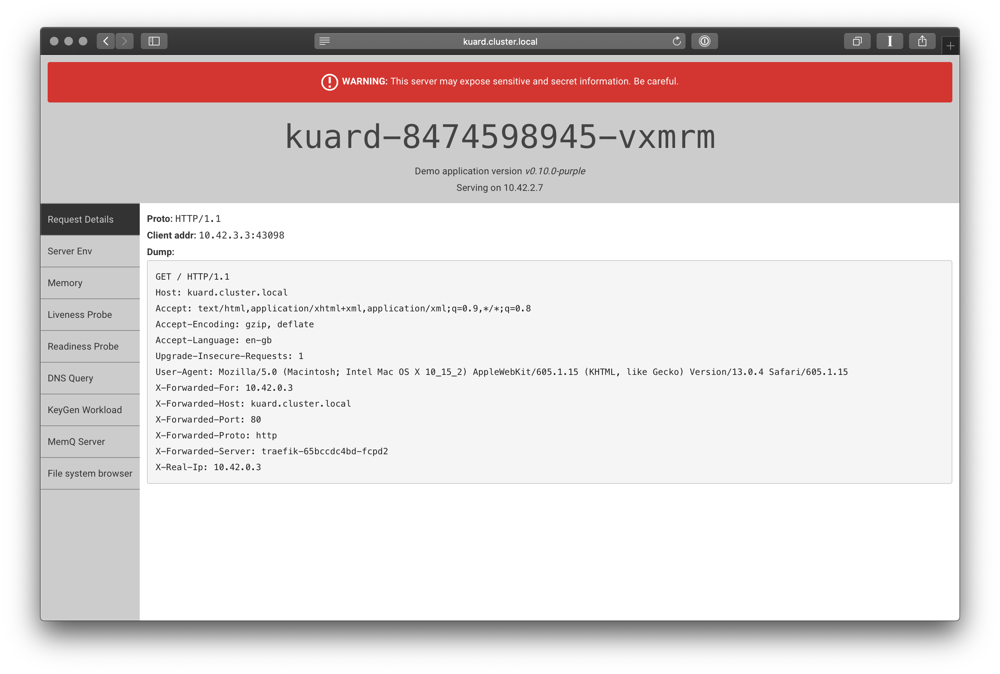
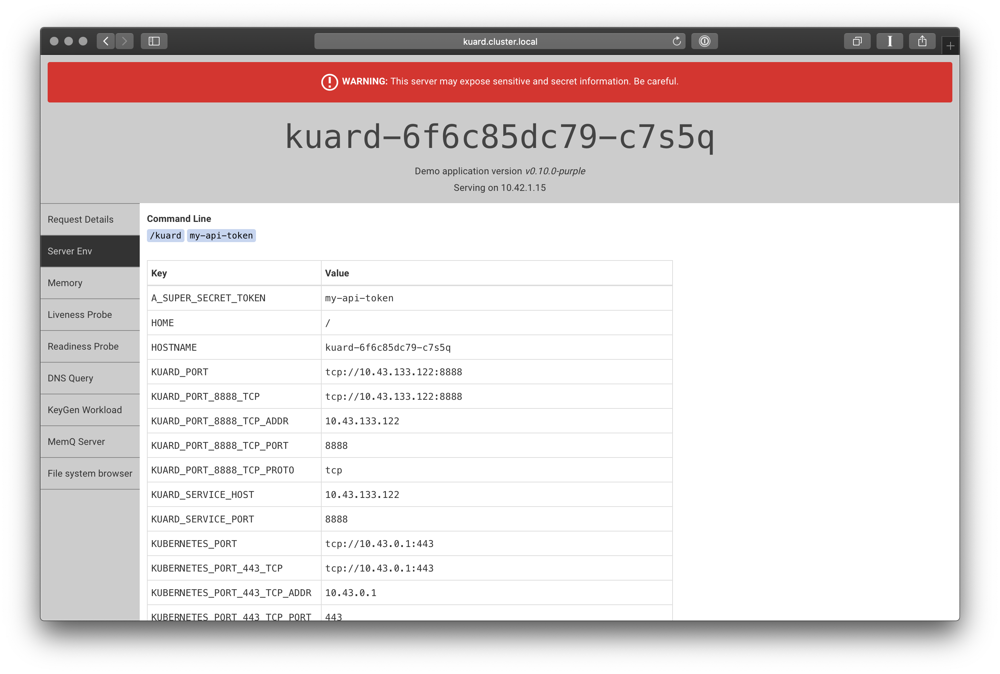

# Tutorial

Now that you have an understanding of the core concepts it is time to try experimenting; for this tutorial you require Docker installed.

You also need to install [kubectl](https://kubernetes.io/docs/tasks/tools/install-kubectl/) and [k3d](https://github.com/rancher/k3d), if you are using a Mac both of these are available via [brew](https://brew.sh).

## Cluster Setup

k3d is a tool for running a virtual cluster in Docker, the first step is to bootstrap a cluster, for this we will create 3 workers and direct port `80` on the local machine to port `80` on the cluster.

```bash
❯ k3d create --name dev2 --api-port 6551 --publish 80:80 --workers 3
```

If everything has worked as intended you should see output like the following

```bash
INFO[0000] Created cluster network with ID e46f7d11b833f74421d8dd19c6fc81780056f08bf37475663e4556e195cb4437
INFO[0000] Created Docker volume  k3d-dev-images
INFO[0000] Creating cluster [dev]
INFO[0000] Creating server using Docker.io/rancher/k3s:v1.0.1...
INFO[0003] Booting 3 workers for cluster dev
INFO[0009] Created worker with ID 60279aafce8dc4aa20c5c481ea2d9807318d296d25b40b7f650f9df0849f15b1
INFO[0010] Created worker with ID 3ca00a875799b18a8e157b319999d76bb617a56b0c251504a7f8e6057315ec36
INFO[0010] Created worker with ID 32b222baaf253a549e3185f5f917882ec400a27fd3aeb389ce754e934fb46d87
INFO[0010] SUCCESS: created cluster [dev]
INFO[0010] You can now use the cluster with:

export KUBECONFIG="$(k3d get-kubeconfig --name='dev')"
kubectl cluster-info
```

You then need to run the `export` line mentioned at the end in any terminal sessions you wish to use.

You can also get the path to config file and merge it with `~/.kube/config`.

```bash
❯ k3d get-kubeconfig --name='dev'
~/.config/k3d/dev/kubeconfig.yaml
```

Note: If you want to destroy the cluster you can run the following command

```bash
❯ k3d del --name dev
```

Now you have created the cluster, ensure everything is working as intended by running `kubectl cluster-info`, you should see output like the following

```bash
❯ kubectl cluster-info
Kubernetes master is running at https://localhost:6551
CoreDNS is running at https://localhost:6551/api/v1/namespaces/kube-system/services/kube-dns:dns/proxy
Metrics-server is running at https://localhost:6551/api/v1/namespaces/kube-system/services/https:metrics-server:/proxy

To further debug and diagnose cluster problems, use 'kubectl cluster-info dump'.
```

If you run `docker ps` you can see the virtual cluster running via Docker.

```bash
❯ docker ps
CONTAINER ID        IMAGE                COMMAND                  CREATED             STATUS              PORTS                                        NAMES
32b222baaf25        rancher/k3s:v1.0.1   "/bin/k3s agent"         8 minutes ago       Up 8 minutes                                                     k3d-dev-worker-2
3ca00a875799        rancher/k3s:v1.0.1   "/bin/k3s agent"         8 minutes ago       Up 8 minutes                                                     k3d-dev-worker-1
60279aafce8d        rancher/k3s:v1.0.1   "/bin/k3s agent"         8 minutes ago       Up 8 minutes                                                     k3d-dev-worker-0
eb59d7980fb8        rancher/k3s:v1.0.1   "/bin/k3s server --h…"   8 minutes ago       Up 8 minutes        0.0.0.0:80->80/tcp, 0.0.0.0:6551->6551/tcp   k3d-dev-server
```

you can also see the *Nodes* using `kubectl get nodes`

```bash
❯ kubectl get nodes
NAME               STATUS   ROLES    AGE     VERSION
k3d-dev-server     Ready    master   8m36s   v1.16.3-k3s.2
k3d-dev-worker-0   Ready    <none>   8m35s   v1.16.3-k3s.2
k3d-dev-worker-1   Ready    <none>   8m34s   v1.16.3-k3s.2
k3d-dev-worker-2   Ready    <none>   8m34s   v1.16.3-k3s.2
```

In a normal Kubernetes cluster *Pods* should not be scheduled on the master *Nodes*, however as k3d is a virtual cluster it is not set up like this. You can change this by applying a *taint* to the *Node*, *taints* are a way to tell the *Scheduler* not to schedule *Pods* on the *Node*. By default, master has a *taint*, however they can also be used for other things, for example if you have a *Node* with a special GPU or a slow hard drive you would apply a *taint* to prevent scheduling.

*Pods* can define *tolerations* to say that they are able to tolerate particular *taints*, such as a slow hard drive. However, having a *toleration* does not mean the *Pod* will be scheduled on the *Node*, just that it can be; if you want to ensure the *Pod* is scheduled on *Nodes* with particular *taints* you would use *nodeAffinity* (you can also use a *nodeSelector* but this simply allows you to specify that it must be scheduled on a *Node* with specified *Labels*, without enforcing that others *Pods* should not be).

Now you have an understanding of *taints* and *tolerations* you should *taint* the master *Node*.

```bash
❯ kubectl taint nodes k3d-dev-server node-role.kubernetes.io/master="":NoSchedule
node/k3d-dev-server tainted
```

It is also useful to *Label* the workers so that they can be easily identified. *Labels* are pieces of metadata which can be applied to all resources as a means of describing them, for example you could use a "maintainer" *Label* to specify who maintains the resource, a "project" *Label* to specify which project the resources belong to or a "cost" *Label* to specify a cost center for reporting purposes. There are a set of [recommended labels](https://kubernetes.io/docs/concepts/overview/working-with-objects/common-labels/).

Let's apply the "node-role.kubernetes.io" *Label* to the workers.

```bash
❯ kubectl label node k3d-dev-worker-0 node-role.kubernetes.io/worker=worker
node/k3d-dev-worker-0 labeled

❯ kubectl label node k3d-dev-worker-1 node-role.kubernetes.io/worker=worker
node/k3d-dev-worker-1 labeled

❯ kubectl label node k3d-dev-worker-2 node-role.kubernetes.io/worker=worker
node/k3d-dev-worker-2 labeled
```

Now if you get the *Nodes* you will see that the workers have a role defined.

```bash
❯ kubectl get nodes
NAME               STATUS   ROLES    AGE   VERSION
k3d-dev-server     Ready    master   22m   v1.16.3-k3s.2
k3d-dev-worker-0   Ready    worker   22m   v1.16.3-k3s.2
k3d-dev-worker-1   Ready    worker   22m   v1.16.3-k3s.2
k3d-dev-worker-2   Ready    worker   22m   v1.16.3-k3s.2
```

## Creating a Pod

Now that you have a running cluster, it is time to create a *Pod*. Thoughout this tutorial we will be using an application called [kuard](https://github.com/kubernetes-up-and-running/kuard) from the "Kubernetes Up and Running" book.

Create the following file and save it as `1-pod.yaml`. This file contains the minimum fields required to create a *Pod*.

```yaml
apiVersion: v1
kind: Pod
metadata:
  name: kuard
spec:
  containers:
    - name: kuard
      image: gcr.io/kuar-demo/kuard-amd64:purple
```

You can use the `kubectl explain` command to get an explaination of each of these fields, for example


```bash
❯ kubectl explain pod.spec.containers
KIND:     Pod
VERSION:  v1

RESOURCE: containers <[]Object>

DESCRIPTION:
     List of containers belonging to the pod. Containers cannot currently be
     added or removed. There must be at least one container in a Pod. Cannot be
     updated.

     A single application container that you want to run within a pod.

FIELDS:
     ...
```

Before going any further, you should open a new terminal (remember to run the `export` command detailed previously) and run the following command, which will get a list of the *Nodes* plus all other resources we will be creating in the "default" *Namespace* and will refresh every 2 seconds, keep this running whilst performing the other commands to see the operations happening.

```bash
watch kubectl get nodes,pod,deploy,rs,svc,ing,cm,secret,pvc,pv -o wide
```

Let's now create the *Pod*.

```bash
❯ kubectl apply -f 1-pod.yaml
pod/kuard created
```

in the other terminal the output should change to include something similar to the following


```bash
NAME        READY   STATUS    RESTARTS   AGE     IP          NODE               NOMINATED NODE   READINESS GATES
pod/kuard   1/1     Running   0          47s     10.42.1.4   k3d-dev-worker-0   <none>           <none>
```

most of the fields here should be self explanatory, ignore the last 2 for now but the one which may not be obvious is the "READY" field, this is telling us that 1 container is running and there are a total of 1 containers defined in the *Pod*, you want both of these numbers to be the same.

Now the *Pod* is running we can connect to it by running a shell interactively or we can run a command directly

```bash
# Start the sh shell
❯ kubectl exec pod/kuard -it sh
~ $

# Run the hostname command
❯ kubectl exec pod/kuard hostname
kuard
```

We can now destroy the *Pod*, we do this by deleting the resource.

```
❯ kubectl delete pod/kuard
pod "kuard" deleted
```

If you watch the other terminal window you will notice that the *Pod* is not recreated, this shows that you can not use them on their own if you want your application to have redundancy.

## Creating a Deployment

Now you know how a *Pod* works, let's create a *Deployment* instead. Save the following YAML as `2-deployment.yaml`.

```yaml
apiVersion: apps/v1
kind: Deployment
metadata:
  name: kuard
  labels:
    app: kuard
spec:
  selector:
    matchLabels:
      app: kuard
  template:
    metadata:
      labels:
        app: kuard
    spec:
      containers:
        - name: kuard
          image: gcr.io/kuar-demo/kuard-amd64:purple
```

As previous, you can use the `kubectl explain` command to get an explaination of each of these fields.

The `metadata.labels` are not needed, but it is common practice to use the same *Labels* on all resources belonging to an application.

The important thing here is `spec.template`, this defines the *Pod* and is similar to the previous file, you will notice though that this time we have a `labels.app` field. There are 2 reasons for this, firstly any *Pods* created by the *Deployment* will not have a name you can specify (although the name is based on the *Deployment* name) so you can use the *Label* to query for *Pods* with the known value; secondly you'll use the same value in `spec.selector.matchLabels` so that the *ReplicaSet* which is created knows which *Pods* belong to it.

Now apply the file

```bash
❯ kubectl apply -f 2-deployment.yaml
deployment.apps/kuard created
```

In the other terminal you should notice that 3 new resources are created, a *Deployment*, a *ReplicaSet* and a *Pod*.

```bash
NAME                         READY   STATUS    RESTARTS   AGE   IP          NODE               NOMINATED NODE   READINESS GATES
pod/kuard-77d8b8d648-lwhkz   1/1     Running   0          51s   10.42.1.5   k3d-dev-worker-0   <none>           <none>

NAME                    READY   UP-TO-DATE   AVAILABLE   AGE   CONTAINERS   IMAGES                                SELECTOR
deployment.apps/kuard   1/1     1            1           51s   kuard        gcr.io/kuar-demo/kuard-amd64:purple   app=kuard

NAME                               DESIRED   CURRENT   READY   AGE   CONTAINERS   IMAGES                                SELECTOR
replicaset.apps/kuard-77d8b8d648   1         1         1       51s   kuard        gcr.io/kuar-demo/kuard-amd64:purple   app=kuard,pod-template-hash=77d8b8d648
```

Now that everything is running, we can delete the *Pod* to show how it is automatically recreated, you can do this with the delete command previously detailed using the *Pod* name, but let's use the *Label* selector to do this instead

```bash
❯ kubectl delete pod -l app=kuard
pod "kuard-77d8b8d648-lwhkz" deleted
```

You should immediately notice a new *Pod* being created whilst the old one is being destroyed.

```bash
NAME                         READY   STATUS              RESTARTS   AGE     IP          NODE               NOMINATED NODE   READINESS GATES
pod/kuard-77d8b8d648-xtjn2   0/1     ContainerCreating   0          1s      <none>      k3d-dev-worker-1   <none>           <none>
pod/kuard-77d8b8d648-lwhkz   0/1     Terminating         0          2m35s   10.42.1.5   k3d-dev-worker-0   <none>           <none>
```

after a few seconds it should be completely replaced

```bash
NAME                         READY   STATUS    RESTARTS   AGE   IP          NODE               NOMINATED NODE   READINESS GATES
pod/kuard-77d8b8d648-xtjn2   1/1     Running   0          57s   10.42.2.5   k3d-dev-worker-1   <none>           <none>
```

You may notice that the "RESTARTS" field is still 0, so why is this? Because the *Pod* has not been restarted, but instead the *Pod* has been destroyed and a completely new one created; in the day to day running of the cluster, when the health checks are failing the *Pods* will instead be restarted.

Now let's see how the *ReplicaSets* work. Change the image tag from `purple` to `blue` and then apply the file again. Whilst you will see the same *Pod* behaviour as deleting a *Pod*, you will also see that there are now 2 *ReplicaSets*

```
NAME                               DESIRED   CURRENT   READY   AGE     CONTAINERS   IMAGES                                SELECTOR
replicaset.apps/kuard-5b89578678   1         1         1       46s     kuard        gcr.io/kuar-demo/kuard-amd64:blue     app=kuard,pod-template-hash=5b89578678
replicaset.apps/kuard-77d8b8d648   0         0         0       7m48s   kuard        gcr.io/kuar-demo/kuard-amd64:purple   app=kuard,pod-template-hash=77d8b8d648
```

This is how Kubernetes performs zero downtime (also called blue/green or A/B) deployments. It creates a new *ReplicaSet*, launches a *Pod* for the new *ReplicaSet* whilst destroying a *Pod* in the old *ReplicaSet* and continues doing this until all *Pods* have been replaced. This is called the `RollingUpdate strategy`, if you instead wanted all *Pods* destroyed first you can set `spec.strategy.type` to `Recreate` on the *Deployment* but then you would not have zero downtime deployments.

Old *ReplicaSets* are deleted based on the `spec.revisionHistoryLimit` field of the *Deployment*, which default is set to 10.

Finally, let's clean up. You can delete the resources manually, but you would need to delete the *Deployment* otherwise the other restores will be recreated automatically (demostrating again that the cluster is self healing). Try deleting the *ReplicaSet* to see that is it recreated, along with a new *Pod*, this shows that the *Controllers* are working as previously described.

Once you are finished, delete using the manifest file, this is normally a better idea as it means you don't accidentially leave any orphaned resources.

```bash
❯ kubectl delete -f 2-deployment.yaml
deployment.apps "kuard" deleted
```

## Making Your Deployment Accessible

Now let's expose our *Pod* to the network.

### Exposing Ports

First we need to expose the ports from the containers, create the file `3-deployment-with-ports.yaml`.

```yaml
apiVersion: apps/v1
kind: Deployment
metadata:
  name: kuard
  labels:
    app: kuard
spec:
  selector:
    matchLabels:
      app: kuard
  template:
    metadata:
      labels:
        app: kuard
    spec:
      containers:
        - name: kuard
          image: gcr.io/kuar-demo/kuard-amd64:purple
          ports:
            - name: http
              containerPort: 8080
```

You will see that we have added the `ports` array to the definition, if you run the explain command you will see that this is purely informational.

```bash
❯ kubectl explain deployment.spec.template.spec.containers.ports
KIND:     Deployment
VERSION:  apps/v1

RESOURCE: ports <[]Object>

DESCRIPTION:
     List of ports to expose from the container. Exposing a port here gives the
     system additional information about the network connections a container
     uses, but is primarily informational. Not specifying a port here DOES NOT
     prevent that port from being exposed. Any port which is listening on the
     default "0.0.0.0" address inside a container will be accessible from the
     network. Cannot be updated.

     ContainerPort represents a network port in a single container.
```

Ports are actually exposed when you build your image, using the `EXPOSE` directive. Although it is not required, it is recommended that you provide the port specification so that other users know which ports are being exposed and so that information can be discovered via the resource definition.

Containers within a *Pod* can communicate with each other via localhost, we will now add a second container to demostrate this.

```yaml
apiVersion: apps/v1
kind: Deployment
metadata:
  name: kuard
  labels:
    app: kuard
spec:
  selector:
    matchLabels:
      app: kuard
  template:
    metadata:
      labels:
        app: kuard
    spec:
      containers:
        - name: curl
          image: appropriate/curl
          command:
            - sh
          args:
            - -c
            - sleep 600
        - name: kuard
          image: gcr.io/kuar-demo/kuard-amd64:purple
          ports:
            - name: http
              containerPort: 8080
```

Now apply the file `kubectl apply -f 3-container-with-ports.yaml`. Once the *Pod* is running we can then run `curl` in the new container to demostrate that they can communicate

```bash
❯ kubectl exec deploy/kuard -c curl curl http://localhost:8080/
  % Total    % Received % Xferd  Average Speed   Time    Time     Time  Current
                                 Dload  Upload   Total   Spent    Left  Speed
100  1465  100  1465    0     0   715k      0 --:--:-- --:--:-- --:--:--  715k
<!doctype html>

<html lang="en">
<head>
  <meta charset="utf-8">

  <title>KUAR Demo</title>
  ...
```

As you can see, the `curl` container (specified by the `-c curl` is able to communicate with the `kuard` container). You can now apply the previous version of the manifest to remove the extra container (you should do this otherwise the Pod will crash after 10 minutes as it is just running `sleep 600`; although you may want to change this value to a lower value such as 10 so that can observe as the container dies and the *Pod* is restarted).

Create a *Pod* for the `curl` container to show that other *Pods* are also able to communicate with it

```yaml
apiVersion: v1
kind: Pod
metadata:
  name: curl
spec:
  containers:
    - name: curl
      image: appropriate/curl
      command:
        - sh
      args:
        - -c
        - sleep 600
```

Get the IP of the `kuard` *Pod* and then run `curl` from the new `curl` *Pod*.


```bash
❯ POD_IP=$(kubectl get pods -l app=kuard -o jsonpath='{.items[0].status.podIP}')

❯ kubectl exec pod/curl curl http://$POD_IP:8080/
  % Total    % Received % Xferd  Average Speed   Time    Time     Time  Current
                                 Dload  Upload   Total   Spent    Left  Speed
100  1471  100  1471    0     0   287k      0 --:--:-- --:--:-- --:--:--  359k
<!doctype html>

<html lang="en">
<head>
  <meta charset="utf-8">

  <title>KUAR Demo</title>
  ...
```

Delete the `curl` *Pod* once done with `kubectl delete pod/curl`.

In the above command you may notice the `-o jsonpath='{.items[0].status.podIP}'` part, the API returns JSON so we can use JSONPath to get specific fields, as we are using a selector `-l app=kuard` rather than a specific *Pod* name it returns an array, hence the `items[0]`.

### Services

This is all well and good, but as you may have noticed, the IP address is not constant, if the *Pod* is destroyed the IP changes.

This is where a *Service* comes in, it will give all the *Pods* in a *ReplicaSet* a single, constant IP address, and it will also give it an addressable name.

Create a file called `4-service.yaml` with the following content

```yaml
apiVersion: v1
kind: Service
metadata:
  name: kuard
  labels:
    app: kuard
spec:
  type: ClusterIP
  ports:
    - port: 8888
      targetPort: http
  selector:
    app: kuard
```

In the *Service* definition you will notice a selector field which is the same as the `spec.selector.matchLabels` from the *Deployment*, this is so that the *Service* knows which *Pods* it should point to. We are using the `type` of `ClusterIP` here, we don't have a `LoadBalancer` so we can not use that, and, since the virtual cluster is running inside Docker we can't use `NodePort` without network changes.
The `ports` indicate which `port` on the service (here `8888`) should map to which `targetPort` on the *Pods* (here it is mapped to the port named `http` but it is also possible to just use the number such as `8080`). If you are exposing more than 1 port in a *Service* then you must give each `port` a `name` field as well, otherwise it is optional.

Apply this file as normal `kubectl apply -f 4-service.yaml`.

You will see a new service is created

```bash
NAME                 TYPE        CLUSTER-IP      EXTERNAL-IP   PORT(S)    AGE    SELECTOR
service/kuard        ClusterIP   10.43.133.122   <none>        8888/TCP   2s     app=kuard
```

If you perform the previous `curl` tests you will see you can now communicate with the *Service* using the "CLUSTER-IP" on the `port`; more importantly, you will now have a DNS name for the service.

```bash
❯ kubectl exec pod/curl curl http://kuard:8888
  % Total    % Received % Xferd  Average Speed   Time    Time     Time  Current
                                 Dload  Upload   Total   Spent    Left  Speed
100  1468  100  1468    0     0   358k      0 --:--:-- --:--:-- --:--:--  358k
<!doctype html>

<html lang="en">
<head>
  <meta charset="utf-8">

  <title>KUAR Demo</title>
  ...
```

You can delete the *Pod* which is backing the service and you will notice that the "CLUSTER-IP" of the *Service* does not change, and you can continue to address it with the same name once the new *Pod* is running.

If we scale so that we have multiple `replicas` of the *Pod* you will notice that you are still able to communicate with the application after killing one of the *Pods* and before the new *Pod* has started.

```bash
❯ kubectl scale deployment kuard --replicas=2
deployment.apps/kuard scaled
```

### Ingress

Previously we mentioned that you need to provide your own *Ingress Controller*, thankfully k3s comes with Traefik already configured so now we can create an *Ingress* resource.

Create a file called `5-ingress.yaml` with the following content.

```yaml
apiVersion: networking.k8s.io/v1beta1
kind: Ingress
metadata:
  name: kuard
  labels:
    app: kuard
spec:
  rules:
    - host: kuard.cluster.local
      http:
        paths:
          - path: /
            backend:
              serviceName: kuard
              servicePort: 8888
```

The *Ingress* defines the `host`, along with `paths`, typically you would just be using a `path` of `/` but there may be situations where you want different paths in an *Ingress* to be backed by different *Services* (thus different *Pods*); under the `path` we then specify which *Service* backs the *Ingress* and the port to map to. The *Ingress Controller* runs on the usual HTTP and HTTPS ports; for HTTPS, SSL is (normally) terminated at the *Ingress* and then communication with the *Pod* is via HTTP.

Apply this file in the usual way and you will see that an *Ingress* is created.

```bash
NAME                       HOSTS                 ADDRESS      PORTS   AGE
ingress.extensions/kuard   kuard.cluster.local   172.21.0.5   80      119s
```

Now you can finally access your application outside of the cluster, but if you open your browser and visit `http://localhost` you will get a 404. So why? This is because the *Ingress* routes based on the host, we haven't defined an *Ingress* for `localhost`, you can change the host to `localhost` and re-apply the manifest, but instead let's use `curl` to prove this.

```bash
❯ curl -H "Host: kuard.cluster.local" http://localhost
<!doctype html>

<html lang="en">
<head>
  <meta charset="utf-8">

  <title>KUAR Demo</title>
  ...
```

As you can see we now get the response we expect, so to get it working correctly in your browser, add the hostname to `/etc/hosts`. If you visit `http://kuard.cluster.local` in your browser you will then see the application.



We now have a fully working application!

## Injecting Configuration

Now that we have created a fully running application we will create a *ConfigMap* and some *Secrets* to demonstrate how these are consumed.

### Using ConfigMaps

First, create a file called `6-configmap.yaml` with the following contents

```yaml
apiVersion: v1
kind: ConfigMap
metadata:
  name: kuard
  labels:
    app: kuard
data:
  kuard.conf: |
    parameter1=value1
    parameter2=value2
    parameter3=value3
    parameter4=value4
  kuard.json: |
    {
      "foo": "bar",
      "baz": "qux"
    }
  token: my-api-token
```

Then apply it as normal

```bash
❯ kubectl apply -f 6-configmap.yaml
configmap/kuard created
```

If everything as worked as intended you will see a new resource

```bash
NAME              DATA   AGE
configmap/kuard   3      14s
```

Now we will update the *Deployment* to make use of the *ConfigMap*.

```yaml
apiVersion: apps/v1
kind: Deployment
metadata:
  name: kuard
  labels:
    app: kuard
spec:
  selector:
    matchLabels:
      app: kuard
  template:
    metadata:
      labels:
        app: kuard
    spec:
      volumes:
        - name: config-volume
          configMap:
            name: kuard
      containers:
        - name: kuard
          image: gcr.io/kuar-demo/kuard-amd64:purple
          ports:
            - name: http
              containerPort: 8080
          volumeMounts:
            - name: config-volume
              mountPath: /config
            - name: config-volume
              mountPath: /app/config.json
              subPath: kuard.json
```

There are several new things here, firstly you will notice `spec.template.spec.volumes` which is an array of *Volumes* which will be available for the containers to mount. The `name` field is compulsory but after that the remaining fields depend on the type of *Volume*. If you use the `kubectl explain` command you will notice that there are a lot of different options, here we are using the `configMap`; other common options include `secret`, `persistentVolumeClaim`, `emptyDir`, `hostPath` (for mounting a path from the physical host) and even `downwardAPI` (for mounting a file containing metadata about the *Pod*), there is also `projected` type for [mounting different sources into the same directory](https://kubernetes.io/docs/tasks/configure-pod-container/configure-projected-volume-storage/).

Defining the *Volume* is not enough, you then need to define where it should be mounted; much like on your computer when you add a new drive, it needs to be configured where it should be mounted (although this probably happens automatically).

The *Volumes* are mounted into each container which requires them, rather than simply into all containers. To do this we define an array of `VolumeMounts` on the container, each mount includes the `name` of the *Volume* we are mounting and the `mountPath` to use.

You may notice that we are mounting the *Volume* twice in this example. First with the `mountPath` set to `/config`, this will mount the entire *ConfigMap* as a directory, which each key representing a file, and secondly we are mounting with `/app/config.json` to represent a single file, here we have a `subPath` parameter which specifies which key from the *ConfigMap* to use.

Apply the manifest for the *Deployment* and we will see the result. Visit the application in your browser again and select the "File System Browser" on the left hand side. You will see a listing with the content of the container's file system, and if you browse around you will discovert the 2 `volumeMounts` we created, firstly the directly `/config` containing all the files and secondly `/app/config.json` specifically being one of the keys. **WARNING** If you mount a volume to a directory `path` any existing files in that directory will be removed.

We previously talked about how the mounted *ConfigMap* is updated in the container if you change it, but there is a pitfull.

Edit the `kuard.json` key in the *ConfigMap* and apply it again. After a few seconds, if you use the "File System Browser" to view the `/config/kuard.json` file you will see that it has been updated, however if you view the `/app/config.json` file it [still has the old value](https://kubernetes.io/docs/tasks/configure-pod-container/configure-pod-configmap/#mounted-configmaps-are-updated-automatically); this is an important distinction to be aware of.

Next, let's try using the *ConfigMap* to populate environment variables, update the manifest like the following.

```yaml
apiVersion: apps/v1
kind: Deployment
metadata:
  name: kuard
  labels:
    app: kuard
spec:
  selector:
    matchLabels:
      app: kuard
  template:
    metadata:
      labels:
        app: kuard
    spec:
      containers:
        - name: kuard
          image: gcr.io/kuar-demo/kuard-amd64:purple
          ports:
            - name: http
              containerPort: 8080
          env:
            - name: A_SUPER_SECRET_TOKEN
              valueFrom:
                configMapKeyRef:
                  name: kuard
                  key: token
          command:
            - "/kuard"
            - "$(A_SUPER_SECRET_TOKEN)"
```

The `volumes` and `volumeMounts` keys have been been removed as we are no longer using the *ConfigMap* as a *Volume*, instead you can see that we have added a new `env` section to the container. As always, you can use the `kubectl explain` command, but the interesting field here is `valueFrom`.


```bash
❯ kubectl explain deployment.spec.template.spec.containers.env.valueFrom
KIND:     Deployment
VERSION:  apps/v1

RESOURCE: valueFrom <Object>

DESCRIPTION:
     Source for the environment variable's value. Cannot be used if value is not
     empty.

     EnvVarSource represents a source for the value of an EnvVar.

FIELDS:
   configMapKeyRef	<Object>
     Selects a key of a ConfigMap.

   fieldRef	<Object>
     Selects a field of the pod: supports metadata.name, metadata.namespace,
     metadata.labels, metadata.annotations, spec.nodeName,
     spec.serviceAccountName, status.hostIP, status.podIP.

   resourceFieldRef	<Object>
     Selects a resource of the container: only resources limits and requests
     (limits.cpu, limits.memory, limits.ephemeral-storage, requests.cpu,
     requests.memory and requests.ephemeral-storage) are currently supported.

   secretKeyRef	<Object>
     Selects a key of a secret in the pod's namespace
```

As you can see, this tells us that we can populate environment variables from *ConfigMaps* and *Secrets*, but we can also populate them from fields from the *Pod* and from the resource limits. Here we are using the `configMapKeyRef` option. We then provide the `name` of the *ConfigMap* to use and the `key` from it; this will result in an environment variable named `A_SUPER_SECRET_TOKEN` being injected into the container.

Finally we have supplied `command`, this allows us to overwrite the command from the Docker image, it has been provided here to show that you can use the environment variables.

Apply the manifest and then visit the application again. Select the "Server Env" option and you will see all the environment variables which exist, you should see `A_SUPER_SECRET_TOKEN`; and at the top of the page you will see the command which was used to launch the process, the variable has been replaced with it's value.



### Using Secrets

## Persisting Data

## Maintaining Application and Cluster Health

## Helm

## Further Reading
