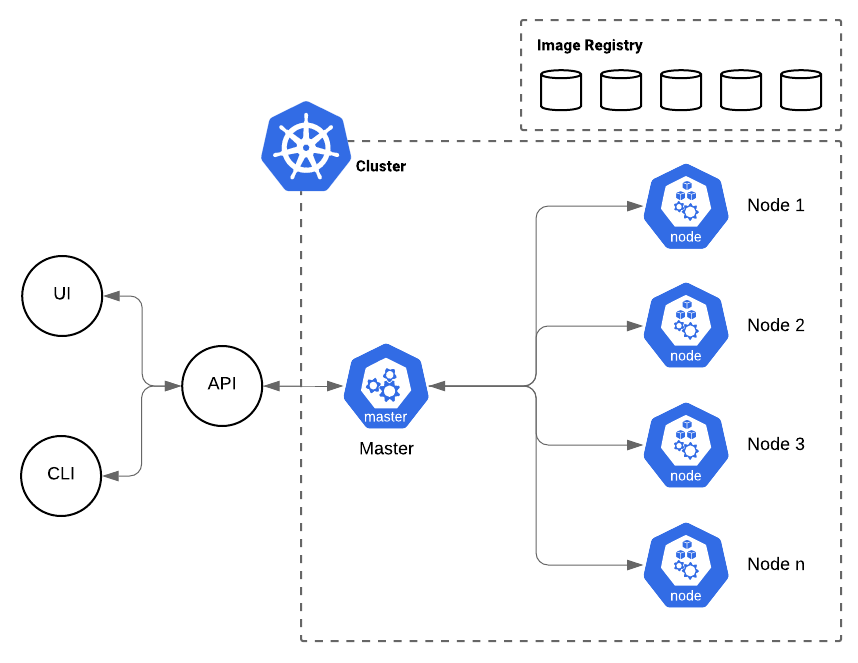
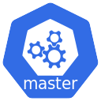
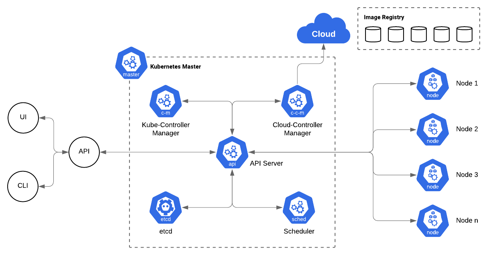
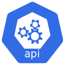
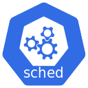
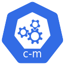
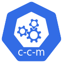
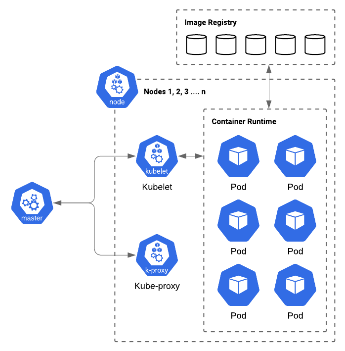
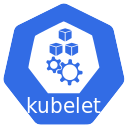
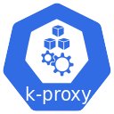

# An introduction to Kubernetes

This guide provides you with an introduction to Kubernetes, it will introduce you to the components, explain how they fit together, introduce you to many of the core resource concepts and then provide you with a tutorial you can follow through yourself to get a grasp on theses concepts.

Kubernetes, often abbreviated as K8S, is an orchestration service, designed by Google, for managing distributed systems. Although you can run it on bare metal, the preferred way is using one of the various cloud providers; Kubernetes will take care of provisioning hardware, allowing you to use all available hardware resources as if it were one giant computer. By specifying the resources required by your application Kubernetes will take care of scheduling them to run on hardware with the appropriate resources available.

## Why use Kubernetes

- **Scalability** - Kubernetes makes scaling applications horizontally very easy, it provides load balancing and provides means of restricting resource consumption. It is even able to scale the number of available *Nodes* on the cluster when you are using a supported cloud platform

- **High Availability** - Kubernetes offers high availability, ensuring the cluster is always available. It allows you to deploy your applications in a redundant manner so that it continues to work even if there is a crash and is self healing so that if your application does crash or there is an issue with a *Node* your end users will never even notice.

- **Security** - Kubernetes offers lots of security features, allowing you to segregate applications by logic groupings called *Namespaces*, limiting resource usage and network traffic (provided you use a suitable network interface, explained later on) and allowing you to separate general application configuration from configuration containing secret information (credentials for instance). It allows you to control who can perform which actions on the cluster using Role-Based Access Control (RBAC) and supports restricting access to your web applications at the *Ingress* level (again, explained in a later chapter).

- **Portability** - You are not restricted to a certain cloud provider, there are interfaces for many providers, as well as the ability to run on bare metal. Kubernetes is available on various architectures, including ARM, running a lab cluster on a set of Raspberry Pis is common. You are also not restricted to a specific container runtime, although you have probably heard of Docker there are many other options available such as containerd, CRI-O, rktd and frakti.

## Components of Kubernetes

Kubernetes runs on the host operating system and provides a cluster on top of that. For this it requires a control plane (also know as the master) and worker nodes; the control plane takes care of managing the state of the cluster whereas the worker nodes run your applications.

The architecture of a cluster looks like the following.

### Control Plane (or Master Node)

The control plane is made up of 4 or 5 components, of which the main part is actually multiple applications bundled into a single binary. The below will give you an introduction to these components.

It is recommended that the control plane is deployed on at least 3 servers to provide redundancy, load balancing and so that they can maintain a quorum. A quorum is how distributed systems enforce consistency, Wikipedia has more [information on this subject](https://en.wikipedia.org/wiki/Quorum_(distributed_computing)), the most important thing to remember is that the control plane should include an odd number of servers to prevent a [split-brain scenario](https://en.wikipedia.org/wiki/Split-brain_(computing)).

The architecture of the control plane is shown below.

#### etcd

The configuration of the cluster is stored as *resource definitions*, this configuration is stored in an etcd cluster. etcd is a strong consistency, high availability, key-value store; it takes care of replicating the state amongst all members of the cluster and resolving conflicts between them. It stores the *desired state* of the cluster and is the *source of truth*.

Although it is a central component of the cluster, you as the operator, and other processes, will never talk to etcd directly. Only one component talks to etcd, that is the API Server.

etcd is not specific to Kubernetes, you can use it for other things (although you should avoid reusing the instance used for Kubernetes), so you can [find out more about it on the website](https://etcd.io).

#### API Server

The *API Server* is the internal event router for Kubernetes. It is the only component which can directly access *etcd* to store and retrieve resource definitions. It is also the proxy between the command line interface, *kubectl*, and the cluster. The CLI talks to the *API Server* exclusively, as do all the other components. The *API Server* simply returns the information from, and stores information in *etcd*; it does nothing else, actually working out what to do is down to other components. It is a stateless component so scales well, typically it would be deployed on the same servers as *etcd*. The *API Server* accepts requests in JSON format.

#### Scheduler

The *Scheduler* takes care of actually placing your applications (known as *Pods*) on worker nodes, it knows about the topology of your cluster and the available resources. The *Scheduler* only talks to the *API Server*, it simply makes decisions on scheduling and then uses the API to change the desired state of the resources. The *Scheduler* is the component which makes sure your *Pods* are scheduled on a machine with the available resources, has the correct *Labels* and adheres to any *NodeAffinity* and *Taints* or *Tolerations* you have configured (You do not need to worry about these concepts now, they will be discussed later).

The *Scheduler* should be deployed redundantly on all the control plane *Nodes*, however, only a single instance operates at any time, the *Nodes* hold leader elections to decide which is considered the "master"; if this instance disappears a new election is held automatically.

#### Kube-Controller Manager

This is the main binary which was mentioned earlier, it is made up of a series of *Controllers*; although they can actually be run separately, they are typically run as a single binary. While the *Scheduler* takes care of placing *Pods*, the *Controllers* take care of almost everything else. There are a variety of *Controllers*, typically one for each resource, such as the *Deployment Controller*, *StatefulSet Controller*, *Namespace Controller*, *ServiceAccount Controller*, *Job Controller* and a *Pod Garbage Collector Controller*. These are just some of the built-in controllers, but it is actually possible to create custom controllers yourself if you are willing to write some code. There are some *Controllers* you are expected to provide yourself, for instance, although Kubernetes has the concept of an *Ingress* it does not include an *Ingress Controller*.

Like the *Scheduler*, the *Controllers* are deployed redundantly and elect a master.

Each *Controller* knows about a single resource type, for example the *Deployment Controller* knows that to create a *Deployment* fully it needs a *ReplicaSet* resource, which it creates, the *ReplicaSet Controller* then knows that it needs to create *Pods*, which are then scheduled by the *Scheduler*.

*Controllers* work using a *Control Loop* (also known as a *Reconcilation Loop*), these run like follows

1. Determine the desired state of the cluster (using the *API Server*)
2. Determine the current state of the cluster (also using the *API Server*)
3. Determine mitigating actions, to get from the current state to the desired state.
4. Make a request to the *API Server* to make the changes required.
5. Return to step 1

You can find all the controllers on the [Kubernetes Github project](https://github.com/kubernetes/kubernetes/tree/master/pkg/controller).

#### Cloud-Controller Manager

If your cluster is running on a cloud provider there is also a fifth component made up of more *Controllers* called *Cloud Controllers*. These are responsible for interacting with your providers API and creating the actual hardware resources needed, for example with AWS the *Node Controller* would create a new EC2 instance if a new *Node* is needed, or a ELB if a *LoadBalancer* *Service* is required.

### Worker Node

The workers are where the real work happens. They are machines which run your applications inside *Containers*, which are created from *Images*. Normally the container runtime used is Docker, however there are many others available, such as containerd, rkt and CRI-O.

Beside the container runtime, there are only 2 components required to run a Kubernetes cluster.

Each of the workers look like the following

#### Kubelet

The *Kubelet* is the part of the worker which is responsible for ensuring that *Pods* are running. It instructs the container runtime to pull images and run them; it coordinates communication between containers in the same *Pod* and ensures that they are scheduled as a single unit on the same *Node*. It queries the *API Server* to check which *Pods* are desired to be running on the *Node* and ensures that they are in the desired state, it reports the health of the *Pods* back to the *API Server* so that the *Scheduler* can update it's scheduling decisions should there be health problems, if *Kubelet* does not report to the *API Server* the *Node* is considered offline so the *Pods* will be rescheduled elsewhere.

*Kubelet* also deals with mounting *ConfigMap* & *Secrets* into containers, along with providing them as environment variables; finally it is also responsible for mounting *Persistent Volumes* and performs the *Liveness Probe* and *Readiness Probe* for keeping the health of the *Pod* in check.

#### Kube-proxy

Despite the name, *Kube-proxy* does not normally act as an actual proxy. It is responsible for ensuring traffic is routed correctly to *Pods*, to do this it makes heavy use of *iptables*; it updates the rules when new *Pods* are created so that traffic is routed correctly as well as deals with DNS for pointing *Services* to *Endpoints*, either locally or on another *Node* and manages port allocation for *NodePorts*. If your operating system doesn't have a packet filtering layer such as iptables then *Kube-proxy* will act as a proxy and forward the requests itself, although this is not the recommended mode of operation.

### Addons

Although that is everything which is needed to run a cluster, there are a few optional addons which are typically installed, although none of these are strictly required for the cluster to function the first 2 at least are recommended if you want a functioning network. They all run as *Pods* on the cluster.

A brief overview is provided below, some of these will be discussed in more detail in a later section.

#### Container Network Interface

You are expected to provide a CNI so that *Pods* are addressable; without a CNI, none of the network functionality works so Kubernetes would only be useful for running *Jobs* and even then not if the *Pod* needed any network access. Kubernetes does not come with a CNI included as there are many available implementations available such as [WeaveNet](https://www.weave.works/oss/net/), [Flannel](https://github.com/coreos/flannel) and [Calico](https://github.com/projectcalico/cni-plugin) due to the [CNI being an open standard](https://github.com/containernetworking/cni).

It is typically installed as a *DaemonSet* (more on those later) on the cluster itself but with privileged access to the host system; it creates an overlay network, which is a virtual network, so that *Pods* are able to communicate regardless of the underlying network infrastructure.

Commonly, Flannel and Calico are used together, this configuration is known as [Canal](https://docs.projectcalico.org/latest/getting-started/kubernetes/installation/flannel); in this configuration, Flannel is responsible for the overlay network while Calico is responsible for enforcing the *NetworkPolicy* (like *Ingress*, it is another resource which Kubernetes defines but does not provide an implementation of out of the box).

#### DNS

The cluster should have a DNS server installed, this will allow *Services* and *Pods* to be addressable by their name. This is independent from the system DNS, most clusters use [CoreDNS](https://kubernetes.io/docs/tasks/administer-cluster/dns-custom-nameservers/#coredns).

#### Ingress Controller

We previously mentioned that Kubernetes does not include an implementation of the *Ingress Controller*, there are many options available, you can even install multiple implementations. Whether you install one, and which you install, will depend upon your requirements.

Popular implementations include [Traefik](https://containo.us/traefik/) and [NGINX Ingress](https://github.com/kubernetes/ingress-nginx).

#### UI

[Kubernetes Dashboard](https://kubernetes.io/docs/tasks/access-application-cluster/web-ui-dashboard/) is a web application which allows users to manage the cluster from their browser.

#### Logging

The cluster will probably need a method of aggregating and persisting all the logs in a central location as logs do not persist when a container crashes or a *Pod* is destroyed. There are several available solutions such as [fluentd](https://www.fluentd.org) with [ELK stack](https://www.elastic.co/what-is/elk-stack), or [Grafana Loki](https://github.com/grafana/loki).

#### Monitoring

You will also probably want to monitor the cluster to be able to detect performance issues and react to them. [Metrics Server](https://github.com/kubernetes-sigs/metrics-server) is used to monitor the resource usage and can be used by the *HorizontalPodAutoscalers*. Alongside the Metrics Server, you will typically install [Prometheus](https://prometheus.io) as a full metrics system, many applications natively expose metrics to Prometheus and there are many "exporters" available to adapt different metrics data sources to the Prometheus format.
