# Kubernetes Resources

There are many different resource definitions in Kubernetes, and with the help of *CustomResourceDefinitions* it is 
possible to define new ones as well, many applications use CRDs to provide a Kubernetes native experience for 
configuring them, these are often referred to as [Kubernetes Operators](https://kubernetes.io/docs/concepts/extend-kubernetes/operator/).

Below you will find explanations of many of the core resources. As the *API Server* exposes all the resources 
using [OpenAPI](https://kubernetes.io/docs/concepts/overview/kubernetes-api/#openapi-and-swagger-definitions) it is 
possible to get a list of all resource types available on a cluster by running the command `kubectl api-resources`, you 
can also find the core resource types in the 
[documentation](https://kubernetes.io/docs/reference/kubectl/overview/#resource-types); you can get an explanation 
of a resource using `kubectl explain <resource>` and even an explanation of an individual field
 using `kubectl explain <resource>.<fieldName>[.<fieldName>]`.

Resources are either scoped to a *Namespace* or are cluster wide, the output of `kubectl api-resources` will tell you 
whether a resource is namespaced or not, but you can add the parameter `--namespaced=true|false` to get only those 
with a specific scope.

Kubernetes resources are normally created in YAML files, called *Manifests* and then applied to the cluster 
using `kubectl apply -f myapp.yaml`.

## Basic Resources

### Pod

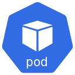

A *Pod* is the smallest unit in Kubernetes, it is a collection of containers which run on a single *Node*. Containers within a *Pod* address each other via the normal loopback interface (localhost), however, containers do not share a filesystem so you need to use a *Volume* to share files between them, although this should be a very rare requirement. Along with containers, *Pods* can have *initContainers*, which are containers which run in sequence before starting the main containers, these can be used to bootstrap the *Pod*, for example by warming up a cache or retrieving data from a remote system.

You would typically run multiple replicas of a *Pod*, which would be scheduled on different *Nodes*, this ensures redundancy so that if a *Node* becomes unavailable your application continues to run without interruption. *Pods* are ephemeral, they are intended to restart automatically when they die, however they are not responsible for handling this, this is down to the *ReplicaSet*, *StatefulSet* or *DaemonSet* (explained below), for this reason you would not typically create *Pods* directly.

Resource limitations can supplied on a per *Container* basis, and you can use the *PriorityClass* field on a *Pod* to enforce a *ResourceQuota*.

### Namespace

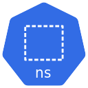

A *Namespace* is a logical grouping of resources, for example you may use *Namespaces* to group your resources by environment such as "prod", "staging" and "dev". By default that is all *Namespaces* are, there is nothing preventing your "dev" *Namespace* from communicating with your "prod" *Namespace* or consuming more resources; this is where you use *NetworkPolicy* resources to control whether *Pods* can communicate across namespaces (assuming you are using an appropriate CNI to enforce them) and *ResourceQuota* resources to enforce limits on the available compute resources (memory and cpu), storage resources and Kubernetes object count. A newly created cluster would have 3 *Namespaces* "default" (where resources are created if no *Namespace* is specified), "kube-public" and "kube-system" (where cluster processes, such as the *Scheduler*, *API Server* and the DNS server are placed).

## Applications

Kubernetes has several different ways to run your application, which one you use depends upon the type of application and it's use-case, either a stateless application, a stateful application or a daemon application.

### Deployment

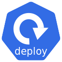

The *Deployment* is a high level abstraction for defining and updating *Pods* and *ReplicaSets*. If you are running a stateless application which needs to run continuously, such as a HTTP server, you will create a *Deployment*. *Deployments* allow you to update a running application without downtime, they also specify a strategy for restarting *Pods* if (or rather, when) they die. This is the type of resources you will normally create most often.

### ReplicaSet

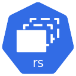

A *Deployment* will create a *ReplicaSet* which will ensure that your application has the desired number of *Pods*. A *ReplicaSet* will create and scale *Pods* to match the criteria defined, such as the number of replicas or the targets defined in a *HorizontalPodAutoscaler*. As with *Pods* you will not normally create a *ReplicaSet* directly, but will instead create them by defining a *Deployment*. If a *Pod* fails for whatever reason, it is the responsibility of the *ReplicaSet* to create a new one to replace it.

### StatefulSet

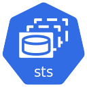

Whilst you would normally be deploying stateless applications, there are times when you need state in your applications, this is what a *StatefulSet* is used for. Unlike *ReplicaSets* there is no high level abstraction so you would create the *StatefulSet* directly, like a *ReplicaSet* it is responsbile for creating *Pods* and scaling them. Unlike a *ReplicaSet* the *Pods* are not interchangeable, they are created in order and with predictable names, for example in a typical *ReplicaSet* you may end up with *Pods* called "myapp-589bd66f5-t7pr2" and "myapp-589bd66f5-r4kxr" (the first part "myapp-589bd66f5" matches the *ReplicaSet*), but when creating *StatefulSets* your *Pods* will be called "myapp-0", "myapp-1" etc which persists if a *Pod* dies and is rescheduled.

This means that *StatefulSets* perform updates in a different manner to *Deployments* if you change the image then *Pods* need to be destroyed and recreated in order.

Data would be stored in a *PersistentVolume* (more on those later), however, unlike with *ReplicaSets* you would have a *Volume* for each *Pod* rather than sharing it between *Pods*. You would typically use *StatefulSets* for things such as [redis](https://redis.io), [etcd](https://etcd.io) or [rabbitmq](https://www.rabbitmq.com), replicating data is down to the individual application.

### DaemonSet

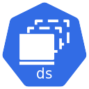

*DaemonSets* are for *Pods* which should run on every *Node* (or every *Node* matching a specified criteria) instead of scaling to a number of replicas; when new *Nodes* are added to the cluster a new *Pod* from the *DaemonSet* would be scheduled on that *Node*. This is typically used for ongoing background processes such as monitoring and log collection.

## Configuration

Configuration is not typically stored in your images, as this would tie them to a specific setup such as the environment, it would mean they need to be rebuilt to update the configuration and you probably don't want sensitive information such as database credentials stored in your image pipeline. To overcome this, Kubernetes provides a means to manage configuration and secret data.

### ConfigMap

A *ConfigMap* is simply a collection of key-value pairs. They can be used in several different ways

- Mounted in whole as a directory into containers where each key is the name of the file created in the directory, and the value is the contents.
- Mount a specific key as a file into the container, where the filename is provided by the *Pod* resource (rather than the *ConfigMap* key) but the value is the contents of the file.
- Injected in whole as environments variables into the container, where the variable name matches the key and the value is the value of the variable.
- Injected individually as environment variables into the container, where the variable name is provided by the *Pod* resource (rather than the *ConfigMap* key) but the value is the value of the variable.

Mounting/injecting the *ConfigMap* into containers is dealt with by *Kubelet*. When a *ConfigMap* is updated it is synced by *Kubelet* with any containers which are using it; however unless your application re-reads the files or variables it will not be aware of the new values, typically you would need to restart the *Pod* for this to occur but there are several tools available to allow this to happen automatically.

### Secret

A *Secret* works in exactly the same way as a *ConfigMap*, the only difference is that it is meant for secret data such as passwords. However, they are not encrypted (although can be encrypted at rest), they are simply base64 encoded (this allows them to contain binary data). When the *Secret* is injected into a container it is decoded, they can be supplied to the container in exactly the same ways as *ConfigMaps*.

The main reason for the distinction between *ConfigMaps* and *Secrets* is so that a *Role* can be granted access to view or manage configuration without having access to *Secrets*.

If you want a more robust and secure secret mechanism you would need to use a solution such as [Hashicorp Vault](https://www.vaultproject.io/docs/platform/k8s/index.html).

## Batch Processes

Along with the continously running processes managed by *ReplicaSets*, *StatefulSets* and *DaemonSets*, Kubernetes also supports running batch processes.

### Jobs

A *Job* is the means of running a batch process, it creates the *Pods* needed and tracks the successful executions, creating new *Pods* as needed until the desired completions are reached. Containers should not run indefinitely but should instead exit when they finish, either with the zero exit code on success or a non-zero code on failure; containers are not restarted automatically when they fail. A *Job* would be used for a batch process you wish to run on demand, for example to process a large set of data.

### Cronjobs

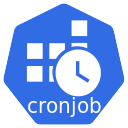

The *Job* concept is extended by *CronJobs*, exactly like system cronjobs these are processes which run regularly, at a specified time. The schedule is defined in exactly the same format as the crontab schedule. The main difference is that a *Cronjob* will only run once at the scheduled time, rather than until a certain number of successful executions.

One pitfull of *Cronjobs* is that because of how they are scheduled you may not aways get exactly 1 execution each time, the *Job* could be missed or could even run more than once; because of this it is important to make sure your *Cronjobs* are idempotent even though these situations are rare.

*Cronjobs* simply define the schedule and then create the *Job* at the expected time.

## Networking

### Service

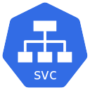

As *Pods* are ephemeral, communicating directly with them can be troublesome as they can disappear at any time and be recreated with a new IP address. A *Service* provides a consistent single IP address for a set of *Pods*, provides port access and most importantly provides a consistent DNS name. This then allows both external users, and other *Pods* to communicate with them.

For example, if you name your *Service* as "my-app", other *Pods* on the same *Namespace* will be able to communicate with it on the address `my-app`, *Pods* in other *Namespaces* will be able to address it as `my-app.namespace`, `my-app.namespace.svc` or `my-app.namespace.svc.cluster.local` (unless you have defined a *NetworkPolicy* to prevent this).

There are several types of *Services* available

- *ClusterIP* - This will dedicate an IP address to the service, this makes the *Service* reachable only within the cluster.
- *LoadBalancer* - This will create a LoadBalancer with your cloud provider to route traffic to your *Pod*.
- *NodePort* - This will open a port on all *Nodes* and point it at your *Pod*.
- *ExternalName* - For forwarding requests to an external DNS address.

### Ingress

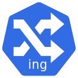

You may notice a problem with *Services*, to route external traffic you either need to use a different port for each of your applications, or have a separate load balancer for each, which would be prohibitively expensive.

This is where the *Ingress* resource comes in. The *Ingress* is backed by an *Ingress Controller*, which acts as a router to route requests to *Services* based on the "Host" header for the request; this means that *Ingress* resources are used for Layer 7 (HTTP) routing.

The *Ingress Controller* is backed by a *Service* with a *LoadBalancer* type, inbound traffic hits the controller, which will then route it to another *Service* (typically with a *ClusterIP* type) using the hostname the request is for. An *Ingress* can also route based on the path for the request, and depending upon which *Ingress Controller* implementation is used, can do things like authentication, IP whitelisting, request modification and SSL termination.

### Endpoints

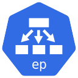

The *Endpoints* is a collection of addresses which implement the actual *Service*; you never need to create these directly as they are created automatically when a *Service* is created. Note the plural, there is no "Endpoint" resource.

## Storage

### PersistentVolumeClaim

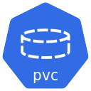

In Kubernetes, when you want some persistent storage, you create a *PersistentVolumeClaim*. This is a request for storage, similar to how *Pods* consume *Node* resources, *PersistentVolumeClaims* consume *PersistentVolume* resources; these allow the user to specify the type, size and access modes required. The claim is mounted as a *Volume* into a *Pod*.

### PersistentVolume

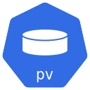

While *PersistentVolumeClaims* define the resources required, they don't define where the storage actually is; this is what a *PersistentVolume* does. A *PersistentVolume* is normally created automatically when a *PersistentVolumeClaim* is mounted in a *Pod*, it will then dynamically provision the actual storage with your provider. However, if you already have the storage created it is possible to create a *PersistentVolume* manually, pointing at the physical storage and then claim it with the *PersistentVolumeClaim*.

*PersistentVolumes* have a lifecycle independent of the *Pod*, they are not deleted when the underlying *Pod* is deleted and they can be configured to persist even if the *PersistentVolumeClaim* is deleted. They are not normally created until the first *Pod* consumes the claim, therefore not using up resources when a claim has never been used.

### StorageClass

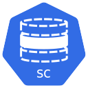

A *StorageClass* allows a cluster administrator to define different types of storage, for instance NFS storage (with different classes for different servers) or cloud provider specific storage such as EFS. They define how dynamic provisioning works, which is handled by the underlying *Controller* depending on the type of storage.

When defining a *PersistentVolumeClaim* you would specify which *StorageClass* to use, and if you do not specify one then the cluster default is used.

### Volumes

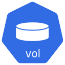

A *Volume* is a component of a *Pod* rather than an independent resource. It is available to all containers within the *Pod* but each container must mount it, this means a single *Volume* could be mounted in different paths on several different containers within the *Pod*. You can use *Volumes* to share an empty directory between containers (which is destroyed when the *Pod* dies), but they are also used to mount *PersistentVolumes*, *ConfigMaps*, *Secrets* and even metadata about the *Pod* (using the *downwardAPI* type).

## Other Resources

There are many other resource types which you may hear talked about, along with the *CustomResourceDefinitions* provided by many applications. These are briefly explained below, see the [Kubernetes documentation](https://kubernetes.io/docs/concepts/) for a full explanation.

### ServiceAccount

Kubernetes distinguishes between the concept of a user account and a service account; a user account is for humans, *ServiceAccounts* are for processes which run in *Pods*. You can specify a *ServiceAccount* when defining a *Pod*, if you don't then the "default" *ServiceAccount* is used. The token for the *ServiceAccount* is automatically mounted to each container in a *Pod* so that the application can use it to authenticate with Kubernetes. They are scoped to a *Namespace*, where as user accounts are global. Normal users and groups are not represented by Kubernetes resources, they are assumed to be managed by outside services; see the [documentation for more information](https://kubernetes.io/docs/reference/access-authn-authz/authentication/#users-in-kubernetes).

### Role

*Roles* are scoped to a *Namespace*, they specify which resources can be accessed and which actions (verbs) can be performed.

### ClusterRole

The same as *Role* but cluster wide

### RoleBinding

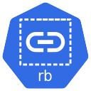

*RoleBindings* binds *Roles* to user accounts, user groups and *ServiceAccounts*.

### ClusterRoleBinding

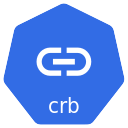

The same as for *RoleBindings* but for *ClusterRoles*

### CustomResourceDefinition

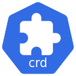

Applications can define their own resources by using a *CustomResourceDefinition*, these allow users to configure applications and provide data to them in a Kubernetes native way.

### ResourceQuota

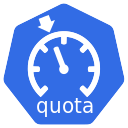

*ResourceQuotas* set aggregate resource restrictions enforced on a per *Namespace* basis.

### LimitRange

A *LimitRange* sets the resources limits for *Pods* and containers, if you create a *Pod* outside of the limits it will be rejected.

### HorizontalPodAutoscaler

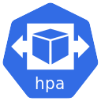

The *HorizontalPodAutoscaler* defines rules for scaling the *Pods* in a *ReplicaSet* or *StatefulSet* based on CPU utilization and custom metrics.

### NetworkPolicy

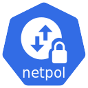

By default, *Pods* are non-isolated and accept all traffic, this can be restricted by a *NetworkPolicy* which can be applied on a per *Pod* or a per *Namespace* basis.

### PodSecurityPolicy

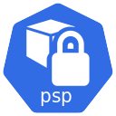

A *PodSecurityPolicy* is a cluster level resource which controls sensitive aspects of a *Pod* specification, such as which *Volume* types can be used, the users that containers can run as and which Linux capabilities can be used.

### PodDisruptionBudget

The *PodDisruptionBudget* specifies the percentage of *Pod* replicas which can be unavailable, for example during a rolling update or when draining a *Node* (evicting all the *Pods*) so that it can be restarted to perform a OS update.
