# Step by Step Tutorial

Now that you have an understanding of the core concepts it is time to try experimenting; for this tutorial you require 
Docker installed.

You also need to install [kubectl](https://kubernetes.io/docs/tasks/tools/install-kubectl/), 
[k3d](https://github.com/rancher/k3d), [watch](https://gitlab.com/procps-ng/procps) if you are using a Mac these 
are available via [brew](https://brew.sh).

Please ensure that you have a recent version of `kubectl`, the version installed by Docker desktop is not recent 
enough. This guide was written using version 1.17.1, use `kubectl version` to confirm the version which you 
have installed.

> Throughout this tutorial you will find diagrams of the state of the cluster, a solid line indicates that the resource
> references the resource it is pointing to, where as a dotted line indicates that it creates the other resource. Each 
> namespace has a "default" *ServiceAccount* with a *Secret*, this will be left out of the diagrams.

## Cluster Setup

k3d is a tool for running a virtual cluster in Docker, the first step is to bootstrap a cluster, for this we will create 3 workers and direct port `80` and `443` on the local machine to the same ports on the cluster.

```bash
❯ k3d create --name dev --api-port 6551 --publish 80:80 --publish 443:443 --workers 3
```

If everything has worked as intended you should see output like the following

```bash
INFO[0000] Created cluster network with ID e46f7d11b833f74421d8dd19c6fc81780056f08bf37475663e4556e195cb4437
INFO[0000] Created Docker volume  k3d-dev-images
INFO[0000] Creating cluster [dev]
INFO[0000] Creating server using Docker.io/rancher/k3s:v1.0.1...
INFO[0003] Booting 3 workers for cluster dev
INFO[0009] Created worker with ID 60279aafce8dc4aa20c5c481ea2d9807318d296d25b40b7f650f9df0849f15b1
INFO[0010] Created worker with ID 3ca00a875799b18a8e157b319999d76bb617a56b0c251504a7f8e6057315ec36
INFO[0010] Created worker with ID 32b222baaf253a549e3185f5f917882ec400a27fd3aeb389ce754e934fb46d87
INFO[0010] SUCCESS: created cluster [dev]
INFO[0010] You can now use the cluster with:

export KUBECONFIG="$(k3d get-kubeconfig --name='dev')"
kubectl cluster-info
```

You then need to run the `export` line mentioned at the end in any terminal sessions you wish to use.

You can also get the path to config file and merge it with `~/.kube/config`.

```bash
❯ k3d get-kubeconfig --name='dev'
~/.config/k3d/dev/kubeconfig.yaml
```

Note: If you want to destroy the cluster you can run the following command (you can also `stop` or `start` the cluster by replacing `del`).

```bash
❯ k3d del --name dev
```

Now you have created the cluster, ensure everything is working as intended by running `kubectl cluster-info`, you should see output like the following

```bash
❯ kubectl cluster-info
Kubernetes master is running at https://localhost:6551
CoreDNS is running at https://localhost:6551/api/v1/namespaces/kube-system/services/kube-dns:dns/proxy
Metrics-server is running at https://localhost:6551/api/v1/namespaces/kube-system/services/https:metrics-server:/proxy

To further debug and diagnose cluster problems, use 'kubectl cluster-info dump'.
```

If you run `docker ps` you can see the virtual cluster running via Docker.

```bash
❯ docker ps
CONTAINER ID        IMAGE                COMMAND                  CREATED             STATUS              PORTS                                                              NAMES
32b222baaf25        rancher/k3s:v1.0.1   "/bin/k3s agent"         8 minutes ago       Up 8 minutes                                                                           k3d-dev-worker-2
3ca00a875799        rancher/k3s:v1.0.1   "/bin/k3s agent"         8 minutes ago       Up 8 minutes                                                                           k3d-dev-worker-1
60279aafce8d        rancher/k3s:v1.0.1   "/bin/k3s agent"         8 minutes ago       Up 8 minutes                                                                           k3d-dev-worker-0
eb59d7980fb8        rancher/k3s:v1.0.1   "/bin/k3s server --h…"   8 minutes ago       Up 8 minutes        0.0.0.0:80->80/tcp, 0.0.0.0:443->443/tcp, 0.0.0.0:6551->6551/tcp   k3d-dev-server
```

you can also see the *Nodes* using `kubectl get nodes`

```bash
❯ kubectl get nodes
NAME               STATUS   ROLES    AGE     VERSION
k3d-dev-server     Ready    master   8m36s   v1.16.3-k3s.2
k3d-dev-worker-0   Ready    <none>   8m35s   v1.16.3-k3s.2
k3d-dev-worker-1   Ready    <none>   8m34s   v1.16.3-k3s.2
k3d-dev-worker-2   Ready    <none>   8m34s   v1.16.3-k3s.2
```

In a normal Kubernetes cluster *Pods* should not be scheduled on the master *Nodes*, however as k3d is a virtual cluster it is not set up like this. You can change this by applying a *taint* to the *Node*, *taints* are a way to tell the *Scheduler* not to schedule *Pods* on the *Node*. By default, master has a *taint*, however they can also be used for other things, for example if you have a *Node* with a special GPU or a slow hard drive you would apply a *taint* to prevent scheduling.

*Pods* can define *tolerations* to say that they are able to tolerate particular *taints*, such as a slow hard drive. However, having a *toleration* does not mean the *Pod* will be scheduled on the *Node*, just that it can be; if you want to ensure the *Pod* is scheduled on *Nodes* with particular *taints* you would use *nodeAffinity* (you can also use a *nodeSelector* but this simply allows you to specify that it must be scheduled on a *Node* with specified *Labels*, without enforcing that others *Pods* should not be).

Now you have an understanding of *taints* and *tolerations* you should *taint* the master *Node*.

```bash
❯ kubectl taint nodes k3d-dev-server node-role.kubernetes.io/master="":NoSchedule
node/k3d-dev-server tainted
```

It is also useful to *Label* the workers so that they can be easily identified. *Labels* are pieces of metadata which can be applied to all resources as a means of describing them, for example you could use a "maintainer" *Label* to specify who maintains the resource, a "project" *Label* to specify which project the resources belong to or a "cost" *Label* to specify a cost center for reporting purposes. There are a set of [recommended labels](https://kubernetes.io/docs/concepts/overview/working-with-objects/common-labels/).

Let's apply the "node-role.kubernetes.io" *Label* to the workers.

```bash
❯ kubectl label node k3d-dev-worker-0 node-role.kubernetes.io/worker=worker
node/k3d-dev-worker-0 labeled

❯ kubectl label node k3d-dev-worker-1 node-role.kubernetes.io/worker=worker
node/k3d-dev-worker-1 labeled

❯ kubectl label node k3d-dev-worker-2 node-role.kubernetes.io/worker=worker
node/k3d-dev-worker-2 labeled
```

Now if you get the *Nodes* you will see that the workers have a role defined.

```bash
❯ kubectl get nodes
NAME               STATUS   ROLES    AGE   VERSION
k3d-dev-server     Ready    master   22m   v1.16.3-k3s.2
k3d-dev-worker-0   Ready    worker   22m   v1.16.3-k3s.2
k3d-dev-worker-1   Ready    worker   22m   v1.16.3-k3s.2
k3d-dev-worker-2   Ready    worker   22m   v1.16.3-k3s.2
```

## Creating a Pod

Now that you have a running cluster, it is time to create a *Pod*. Throughout this tutorial we will be using an application called [kuard](https://github.com/kubernetes-up-and-running/kuard) from the "Kubernetes Up and Running" book.

Create the following file and save it as `1-pod.yaml`. This file contains the minimum fields required to create a *Pod*.

```yaml
apiVersion: v1
kind: Pod
metadata:
  name: kuard
spec:
  containers:
    - name: kuard
      image: gcr.io/kuar-demo/kuard-amd64:purple
```

You can use the `kubectl explain` command to get an explanation of each of these fields, for example

```bash
❯ kubectl explain pod.spec.containers
KIND:     Pod
VERSION:  v1

RESOURCE: containers <[]Object>

DESCRIPTION:
     List of containers belonging to the pod. Containers cannot currently be
     added or removed. There must be at least one container in a Pod. Cannot be
     updated.

     A single application container that you want to run within a pod.

FIELDS:
     ...
```

Before going any further, you should open a new terminal (remember to run the `export` command detailed previously) and run the following command, which will get a list of the *Nodes* plus all other resources we will be creating in the "default" *Namespace* and will refresh every 2 seconds, keep this running whilst performing the other commands to see the operations happening.

```bash
watch kubectl get nodes,pod,deploy,rs,svc,ing,cm,secret,pvc,pv -o wide
```

Let's now create the *Pod*.

```bash
❯ kubectl apply -f 1-pod.yaml
pod/kuard created
```

in the other terminal the output should change to include something similar to the following.

```bash
NAME        READY   STATUS    RESTARTS   AGE     IP          NODE               NOMINATED NODE   READINESS GATES
pod/kuard   1/1     Running   0          47s     10.42.1.4   k3d-dev-worker-0   <none>           <none>
```

Most of the fields here should be self explanatory, ignore the last 2 for now but the one which may not be obvious is the "READY" field, this is telling us that 1 container is running and there are a total of 1 containers defined in the *Pod*, you want both of these numbers to be the same.

Now the *Pod* is running we can connect to it by running a shell interactively or we can run a command directly.

```bash
# Start the sh shell
❯ kubectl exec pod/kuard -it sh
~ $

# Run the hostname command
❯ kubectl exec pod/kuard hostname
kuard
```

At this stage the state of our cluster looks similar to this.

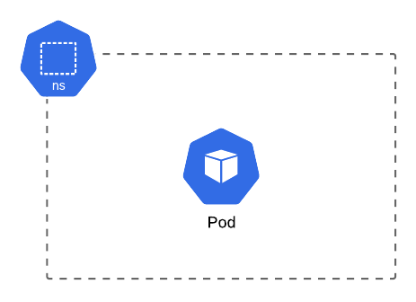

We can now destroy the *Pod*, we do this by deleting the resource.

```bash
❯ kubectl delete pod/kuard
pod "kuard" deleted
```

If you watch the other terminal window you will notice that the *Pod* is not recreated, this shows that you can not use them on their own if you want your application to be self healing.

## Creating a Deployment

Now you know how a *Pod* works, let's create a *Deployment* instead. Save the following YAML as `2-deployment.yaml`.

```yaml
apiVersion: apps/v1
kind: Deployment
metadata:
  name: kuard
  labels:
    app: kuard
spec:
  selector:
    matchLabels:
      app: kuard
  template:
    metadata:
      labels:
        app: kuard
    spec:
      containers:
        - name: kuard
          image: gcr.io/kuar-demo/kuard-amd64:purple
```

As previous, you can use the `kubectl explain` command to get an explanation of each of these fields.

The `metadata.labels` are not needed, but it is common practice to use the same *Labels* on all resources belonging to an application.

The important thing here is `spec.template`, this defines the *Pod* and is similar to the previous file, you will notice though that this time we have a `labels.app` field. There are 2 reasons for this, firstly any *Pods* created by the *Deployment* will not have a name you can specify (although the name is based on the *Deployment* name) so you can use the *Label* to query for *Pods* with the known value; secondly you'll use the same value in `spec.selector.matchLabels` so that the *ReplicaSet* which is created knows which *Pods* belong to it.

Now apply the file

```bash
❯ kubectl apply -f 2-deployment.yaml
deployment.apps/kuard created
```

In the other terminal you should notice that 3 new resources are created, a *Deployment*, a *ReplicaSet* and a *Pod*.

```bash
NAME                         READY   STATUS    RESTARTS   AGE   IP          NODE               NOMINATED NODE   READINESS GATES
pod/kuard-77d8b8d648-lwhkz   1/1     Running   0          51s   10.42.1.5   k3d-dev-worker-0   <none>           <none>

NAME                    READY   UP-TO-DATE   AVAILABLE   AGE   CONTAINERS   IMAGES                                SELECTOR
deployment.apps/kuard   1/1     1            1           51s   kuard        gcr.io/kuar-demo/kuard-amd64:purple   app=kuard

NAME                               DESIRED   CURRENT   READY   AGE   CONTAINERS   IMAGES                                SELECTOR
replicaset.apps/kuard-77d8b8d648   1         1         1       51s   kuard        gcr.io/kuar-demo/kuard-amd64:purple   app=kuard,pod-template-hash=77d8b8d648
```

Now that everything is running, we can delete the *Pod* to show how it is automatically recreated, you can do this with the delete command previously detailed using the *Pod* name, but let's use the *Label* selector to do this instead.

```bash
❯ kubectl delete pod -l app=kuard
pod "kuard-77d8b8d648-lwhkz" deleted
```

You should immediately notice a new *Pod* being created whilst the old one is being destroyed.

```bash
NAME                         READY   STATUS              RESTARTS   AGE     IP          NODE               NOMINATED NODE   READINESS GATES
pod/kuard-77d8b8d648-xtjn2   0/1     ContainerCreating   0          1s      <none>      k3d-dev-worker-1   <none>           <none>
pod/kuard-77d8b8d648-lwhkz   0/1     Terminating         0          2m35s   10.42.1.5   k3d-dev-worker-0   <none>           <none>
```

after a few seconds it should be completely replaced

```bash
NAME                         READY   STATUS    RESTARTS   AGE   IP          NODE               NOMINATED NODE   READINESS GATES
pod/kuard-77d8b8d648-xtjn2   1/1     Running   0          57s   10.42.2.5   k3d-dev-worker-1   <none>           <none>
```

You may notice that the "RESTARTS" field is still 0, so why is this? Because the *Pod* has not been restarted, but instead the *Pod* has been destroyed and a completely new one created; in the day to day running of the cluster, when the health checks are failing the *Pods* will instead be restarted.

The cluster now looks like the following.

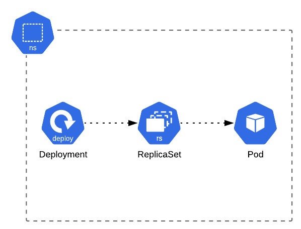

Now let's see how the *ReplicaSets* work. Change the image tag from `purple` to `blue` and then apply the file again. Whilst you will see the same *Pod* behaviour as deleting a *Pod*, you will also see that there are now 2 *ReplicaSets*

FIXME: Add something about image pull policy and latest tag

```bash
NAME                               DESIRED   CURRENT   READY   AGE     CONTAINERS   IMAGES                                SELECTOR
replicaset.apps/kuard-5b89578678   1         1         1       46s     kuard        gcr.io/kuar-demo/kuard-amd64:blue     app=kuard,pod-template-hash=5b89578678
replicaset.apps/kuard-77d8b8d648   0         0         0       7m48s   kuard        gcr.io/kuar-demo/kuard-amd64:purple   app=kuard,pod-template-hash=77d8b8d648
```

This is how Kubernetes performs zero downtime (also called blue-green or A/B) deployments. It creates a new *ReplicaSet*, launches a *Pod* for the new *ReplicaSet* whilst destroying a *Pod* in the old *ReplicaSet* and continues doing this until all *Pods* have been replaced. This is called the `RollingUpdate strategy`, if you instead wanted all *Pods* destroyed first you can set `spec.strategy.type` to `Recreate` on the *Deployment* but then you would not have zero downtime deployments.

Old *ReplicaSets* are deleted based on the `spec.revisionHistoryLimit` field of the *Deployment*, which default is set to 10.

Finally, let's clean up. You can delete the resources manually, but you would need to delete the *Deployment* otherwise the other restores will be recreated automatically (demonstrating again that the cluster is self healing). Try deleting the *ReplicaSet* to see that it is recreated, along with a new *Pod*, this shows that the *Controllers* are working as previously described.

The cluster will now look like the following. (Note: After this point the old *ReplicaSets* won't be included in these diagrams).

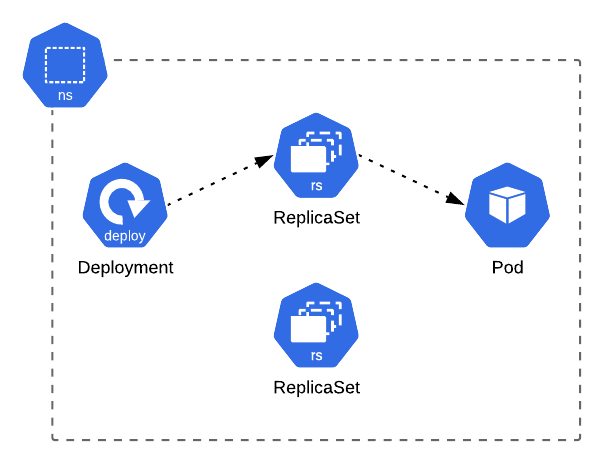

Once you are finished, delete using the manifest file, this is normally a better idea as it means you don't accidentally leave any orphaned resources.

```bash
❯ kubectl delete -f 2-deployment.yaml
deployment.apps "kuard" deleted
```

## Making Your Deployment Accessible

Now let's expose our *Pod* to the network.

### Exposing Ports

First we need to expose the ports from the containers, create the file `3-deployment-with-ports.yaml`.

```yaml
apiVersion: apps/v1
kind: Deployment
metadata:
  name: kuard
  labels:
    app: kuard
spec:
  selector:
    matchLabels:
      app: kuard
  template:
    metadata:
      labels:
        app: kuard
    spec:
      containers:
        - name: kuard
          image: gcr.io/kuar-demo/kuard-amd64:purple
          ports:
            - name: http
              containerPort: 8080
```

You will see that we have added the `ports` array to the definition, if you run the explain command you will see that this is purely informational.

```bash
❯ kubectl explain deployment.spec.template.spec.containers.ports
KIND:     Deployment
VERSION:  apps/v1

RESOURCE: ports <[]Object>

DESCRIPTION:
     List of ports to expose from the container. Exposing a port here gives the
     system additional information about the network connections a container
     uses, but is primarily informational. Not specifying a port here DOES NOT
     prevent that port from being exposed. Any port which is listening on the
     default "0.0.0.0" address inside a container will be accessible from the
     network. Cannot be updated.

     ContainerPort represents a network port in a single container.
```

Ports are actually exposed when you build your image, using the `EXPOSE` directive. Although it is not required, it is recommended that you provide the port specification so that other users know which ports are being exposed and so that information can be discovered via the resource definition.

#### Communication within a Pod

Containers within a *Pod* can communicate with each other via localhost, we will now add a second container to demonstrate this.

```yaml
apiVersion: apps/v1
kind: Deployment
metadata:
  name: kuard
  labels:
    app: kuard
spec:
  selector:
    matchLabels:
      app: kuard
  template:
    metadata:
      labels:
        app: kuard
    spec:
      containers:
        - name: curl
          image: appropriate/curl
          command:
            - sh
          args:
            - -c
            - sleep 600
        - name: kuard
          image: gcr.io/kuar-demo/kuard-amd64:purple
          ports:
            - name: http
              containerPort: 8080
```

Now apply the file `kubectl apply -f 3-container-with-ports.yaml`. Once the *Pod* is running we can then run `curl` in the new container to demonstrate that they can communicate

```bash
❯ kubectl exec deploy/kuard -c curl curl http://localhost:8080/
  % Total    % Received % Xferd  Average Speed   Time    Time     Time  Current
                                 Dload  Upload   Total   Spent    Left  Speed
100  1465  100  1465    0     0   715k      0 --:--:-- --:--:-- --:--:--  715k
<!doctype html>

<html lang="en">
<head>
  <meta charset="utf-8">

  <title>KUAR Demo</title>
  ...
```

As you can see, the `curl` container (specified by the `-c curl`) is able to communicate with the `kuard` container. You can now apply the previous version of the manifest to remove the extra container (you should do this otherwise the Pod will crash after 10 minutes as it is just running `sleep 600`; although you may want to change this value to a lower value such as 10 so that can observe as the container dies and the *Pod* is restarted).

#### Communication between Pods

Containers in different *Pods* can communicate with each other using IP addresses, we will now add a second *Pod* to demonstrate this.

```yaml
apiVersion: v1
kind: Pod
metadata:
  name: curl
spec:
  containers:
    - name: curl
      image: appropriate/curl
      command:
        - sh
      args:
        - -c
        - sleep 600
```

Get the IP of the `kuard` *Pod* and then run `curl` from the new `curl` *Pod*.

```bash
❯ POD_IP=$(kubectl get pods -l app=kuard -o jsonpath='{.items[0].status.podIP}')

❯ kubectl exec pod/curl curl http://$POD_IP:8080/
  % Total    % Received % Xferd  Average Speed   Time    Time     Time  Current
                                 Dload  Upload   Total   Spent    Left  Speed
100  1471  100  1471    0     0   287k      0 --:--:-- --:--:-- --:--:--  359k
<!doctype html>

<html lang="en">
<head>
  <meta charset="utf-8">

  <title>KUAR Demo</title>
  ...
```

Delete the `curl` *Pod* once done with `kubectl delete pod/curl`.

In the above command you may notice the `-o jsonpath='{.items[0].status.podIP}'` part, the API returns JSON so we can use JSONPath to get specific fields, as we are using a selector `-l app=kuard` rather than a specific *Pod* name it returns an array, hence the `items[0]`.

### Services

This is all well and good, but as you may have noticed, the IP address is not constant, if the *Pod* is destroyed the IP changes.

This is where a *Service* comes in, it will give all the *Pods* in a *ReplicaSet* a single, constant IP address, and it will also give it an addressable name.

Create a file called `4-service.yaml` with the following content

```yaml
apiVersion: v1
kind: Service
metadata:
  name: kuard
  labels:
    app: kuard
spec:
  type: ClusterIP
  ports:
    - port: 8888
      targetPort: http
  selector:
    app: kuard
```

In the *Service* definition you will notice a selector field which is the same as the `spec.selector.matchLabels` from the *Deployment*, this is so that the *Service* knows which *Pods* it should point to. We are using the `type` of `ClusterIP` here, we don't have a `LoadBalancer` so we can not use that, and, since the virtual cluster is running inside Docker we can't use `NodePort` without network changes.

The `ports` indicate which `port` on the service (here `8888`) should map to which `targetPort` on the *Pods* (here it is mapped to the port named `http` but it is also possible to just use the number such as `8080`). If you are exposing more than 1 port in a *Service* then you must give each `port` a `name` field as well, otherwise it is optional.

Apply this file as normal `kubectl apply -f 4-service.yaml`.

You will see a new service is created

```bash
NAME                 TYPE        CLUSTER-IP      EXTERNAL-IP   PORT(S)    AGE    SELECTOR
service/kuard        ClusterIP   10.43.133.122   <none>        8888/TCP   2s     app=kuard
```

If you perform the previous `curl` tests you will see you can now communicate with the *Service* using the "CLUSTER-IP" on the `port`; more importantly, you will now have a DNS name for the service.

```bash
❯ kubectl exec pod/curl curl http://kuard:8888
  % Total    % Received % Xferd  Average Speed   Time    Time     Time  Current
                                 Dload  Upload   Total   Spent    Left  Speed
100  1468  100  1468    0     0   358k      0 --:--:-- --:--:-- --:--:--  358k
<!doctype html>

<html lang="en">
<head>
  <meta charset="utf-8">

  <title>KUAR Demo</title>
  ...
```

You can delete the *Pod* which is backing the service and you will notice that the "CLUSTER-IP" of the *Service* does not change, and you can continue to address it with the same name once the new *Pod* is running.

The cluster now looks like this.

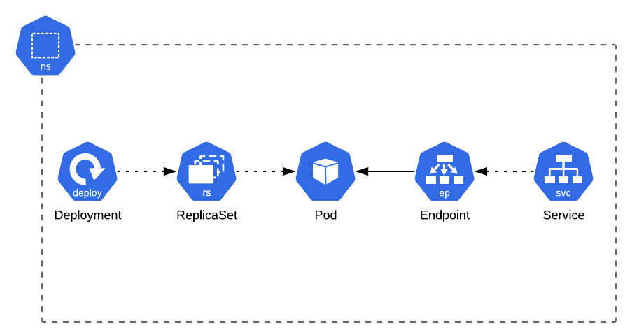

You may notice the *Endpoints*, just like *Deployments* create *ReplicaSets* which point at the specific *Pods*, *Services* are backed by *Endpoints* which point to the *Pods*. You can see how this looks (bear in mind your output will differ).

```bash
❯ kubectl get endpoints/kuard -o yaml
apiVersion: v1
kind: Endpoints
metadata:
  name: kuard
  namespace: default
  labels:
    app: kuard
subsets:
  - addresses:
    - ip: 10.42.1.7
      nodeName: k3d-dev-worker-1
      targetRef:
        kind: Pod
        name: kuard-6c7b4f7bf-wrlgw
        namespace: default
    ports:
      - port: 8080
        protocol: TCP
```

Now, let's scale so that we have multiple `replicas` of the *Pod*. You will notice that you are still able to communicate with the application after killing one of the *Pods* and before the new *Pod* has started.

```bash
❯ kubectl scale deployment/kuard --replicas=2
deployment.apps/kuard scaled
```

After scaling the replicas the cluster looks like this (Again, from this point only 1 *Pod* will be shown to represent all *Pods* in a *ReplicaSet*).

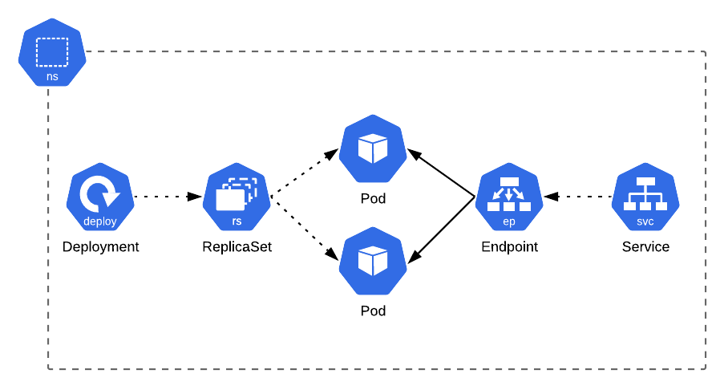

### Ingress

Previously we mentioned that you need to provide your own *Ingress Controller*, thankfully k3s comes with Traefik already configured so now we can create an *Ingress* resource.

Create a file called `5-ingress.yaml` with the following content.

```yaml
apiVersion: networking.k8s.io/v1beta1
kind: Ingress
metadata:
  name: kuard
  labels:
    app: kuard
  annotations:
    kubernetes.io/ingress.class: traefik
spec:
  rules:
    - host: kuard.cluster.local
      http:
        paths:
          - path: /
            backend:
              serviceName: kuard
              servicePort: 8888
```

The *Ingress* defines the `host`, along with `paths`, typically you would just be using a `path` of `/` but there may be situations where you want different paths in an *Ingress* to be backed by different *Services* (thus different *Pods*); under the `path` we then specify which *Service* backs the *Ingress* and the port to map to. The *Ingress Controller* runs on the usual HTTP and HTTPS ports; for HTTPS, SSL is (normally) terminated at the *Ingress* and then communication with the *Pod* is via HTTP.

You may notice a new field called `annotations`, don't worry about this for now, it will be explained later, just know that they are similar to *Labels* but used for configuration. The first field `kubernetes.io/ingress.class` is not strictly required, however, as mentioned in the introduction, a cluster can have multiple *Ingress Controllers* installed, so it is recommended that you always supply the name of the implementation you wish to use to prevent issues.

Apply this file in the usual way and you will see that an *Ingress* is created.

```bash
NAME                       HOSTS                 ADDRESS      PORTS   AGE
ingress.extensions/kuard   kuard.cluster.local   172.21.0.5   80      119s
```

Now our cluster looks like this

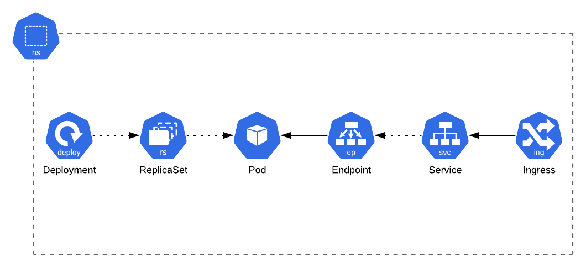

Now you can finally access your application outside of the cluster, but if you open your browser and visit `http://localhost` you will get a 404. So why? This is because the *Ingress* routes based on the host, we haven't defined an *Ingress* for `localhost`, you can change the host to `localhost` and re-apply the manifest, but instead let's use `curl` to prove this.

```bash
❯ curl -H "Host: kuard.cluster.local" http://localhost
<!doctype html>

<html lang="en">
<head>
  <meta charset="utf-8">

  <title>KUAR Demo</title>
  ...
```

As you can see we now get the response we expect, so to get it working correctly in your browser, add the hostname to `/etc/hosts`. If you visit `http://kuard.cluster.local` in your browser you will then see the application.

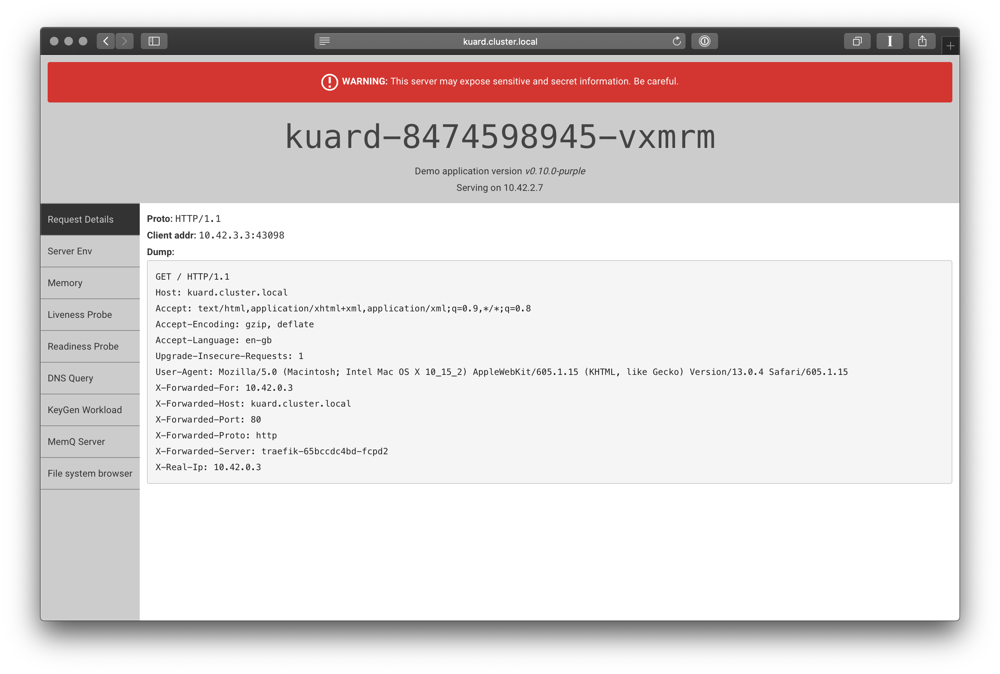

We now have a fully working application!

## Injecting Configuration

Now that we have created a fully running application we will create a *ConfigMap* and some *Secrets* to demonstrate how these are consumed.

### Using ConfigMaps

First, create a file called `6-configmap.yaml` with the following contents

```yaml
apiVersion: v1
kind: ConfigMap
metadata:
  name: kuard
  labels:
    app: kuard
data:
  kuard.conf: |
    parameter1=value1
    parameter2=value2
    parameter3=value3
    parameter4=value4
  kuard.json: |
    {
      "foo": "bar",
      "baz": "qux"
    }
  token: my-api-token
```

Then apply it as normal

```bash
❯ kubectl apply -f 6-configmap.yaml
configmap/kuard created
```

If everything as worked as intended you will see a new resource

```bash
NAME              DATA   AGE
configmap/kuard   3      14s
```

Now we will update the *Deployment* to make use of the *ConfigMap*.

```yaml
apiVersion: apps/v1
kind: Deployment
metadata:
  name: kuard
  labels:
    app: kuard
spec:
  selector:
    matchLabels:
      app: kuard
  template:
    metadata:
      labels:
        app: kuard
    spec:
      volumes:
        - name: config-volume
          configMap:
            name: kuard
      containers:
        - name: kuard
          image: gcr.io/kuar-demo/kuard-amd64:purple
          ports:
            - name: http
              containerPort: 8080
          volumeMounts:
            - name: config-volume
              mountPath: /config
            - name: config-volume
              mountPath: /app/config.json
              subPath: kuard.json
```

<<<<<<< HEAD:manuscript/3-tutorial.md
<<<<<<< HEAD:3-tutorial.md
There are several new things here, firstly you will notice `spec.template.spec.volumes` which is an array of *Volumes* 
which will be available for the containers to mount. The `name` field is required but after that the remaining 
fields depend on the type of *Volume*. If you use the `kubectl explain` command you will notice that there are a lot 
of different options, here we are using the `configMap`; other common options include `secret`, 
`persistentVolumeClaim`, `emptyDir`, `hostPath` (for mounting a path from the physical host) and even 
`downwardAPI` (for mounting a file containing metadata about the *Pod*), there is also `projected` type 
for [mounting different sources into the same directory](https://kubernetes.io/docs/tasks/configure-pod-container/configure-projected-volume-storage/).
There are several new things here, firstly you will notice `spec.template.spec.volumes` which is an array of *Volumes* which will be available for the containers to mount. The `name` field is compulsory but after that the remaining fields depend on the type of *Volume*. If you use the `kubectl explain` command you will notice that there are a lot of different options, here we are using the `configMap`; other common options include `secret`, `persistentVolumeClaim`, `emptyDir`, `hostPath` (for mounting a path from the physical host) and even `downwardAPI` (for mounting a file containing metadata about the *Pod*), there is also `projected` type for [mounting different sources into the same directory](https://kubernetes.io/docs/tasks/configure-pod-container/configure-projected-volume-storage/).

Defining the *Volume* is not enough, you then need to define where it should be mounted; much like on your computer when you add a new drive, it needs to be configured to define where it should be mounted (although this probably happens automatically).

The *Volumes* are mounted into each container which require them, rather than simply into all containers. To do this we define an array of `VolumeMounts` on the container, each mount includes the `name` of the *Volume* we are mounting and the `mountPath` to use.

You may notice that we are mounting the *Volume* twice in this example. First with the `mountPath` set to `/config`, this will mount the entire *ConfigMap* as a directory, with each key representing a file, and secondly we are mounting with `/app/config.json` to represent a single file, here we have a `subPath` parameter that specifies which key from the *ConfigMap* to use.

Apply the manifest for the *Deployment* and we will see the result. Visit the application in your browser again and select the "File System Browser" on the left hand side. You will see a listing with the content of the container's file system, and if you browse around you will discover the 2 `volumeMounts` we created, firstly the directory `/config` containing all the files and secondly `/app/config.json` specifically being one of the keys.
 
**WARNING** If you mount a volume to a directory `path` any existing files in that directory will be removed.

Now our cluster has a state which looks like the following.

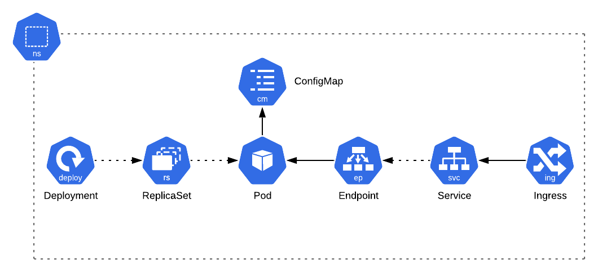

We previously talked about how the mounted *ConfigMap* is updated in the container if you change it, but there is a pitfall...

Edit the `kuard.json` key in the *ConfigMap* and apply it again. After a few seconds, if you use the "File System Browser" to view the `/config/kuard.json` file you will see that it has been updated, however if you view the `/app/config.json` file it [still has the old value](https://kubernetes.io/docs/tasks/configure-pod-container/configure-pod-configmap/#mounted-configmaps-are-updated-automatically); this is an important distinction to be aware of.

Next, let's try using the *ConfigMap* to populate environment variables, update the manifest like the following.

```yaml
apiVersion: apps/v1
kind: Deployment
metadata:
  name: kuard
  labels:
    app: kuard
spec:
  selector:
    matchLabels:
      app: kuard
  template:
    metadata:
      labels:
        app: kuard
    spec:
      containers:
        - name: kuard
          image: gcr.io/kuar-demo/kuard-amd64:purple
          ports:
            - name: http
              containerPort: 8080
          env:
            - name: A_SUPER_SECRET_TOKEN
              valueFrom:
                configMapKeyRef:
                  name: kuard
                  key: token
          command:
            - "/kuard"
            - "$(A_SUPER_SECRET_TOKEN)"
```

The `volumes` and `volumeMounts` keys have been been removed as we are no longer using the *ConfigMap* as a *Volume*, instead you can see that we have added a new `env` section to the container. As always, you can use the `kubectl explain` command, but the interesting field here is `valueFrom`.

```bash
❯ kubectl explain deployment.spec.template.spec.containers.env.valueFrom
KIND:     Deployment
VERSION:  apps/v1

RESOURCE: valueFrom <Object>

DESCRIPTION:
     Source for the environment variable's value. Cannot be used if value is not
     empty.

     EnvVarSource represents a source for the value of an EnvVar.

FIELDS:
   configMapKeyRef <Object>
     Selects a key of a ConfigMap.

   fieldRef <Object>
     Selects a field of the pod: supports metadata.name, metadata.namespace,
     metadata.labels, metadata.annotations, spec.nodeName,
     spec.serviceAccountName, status.hostIP, status.podIP.

   resourceFieldRef <Object>
     Selects a resource of the container: only resources limits and requests
     (limits.cpu, limits.memory, limits.ephemeral-storage, requests.cpu,
     requests.memory and requests.ephemeral-storage) are currently supported.

   secretKeyRef <Object>
     Selects a key of a secret in the pod's namespace
```

As you can see, this tells us that we can populate environment variables from *ConfigMaps* and *Secrets*, but we can also populate them from fields from the *Pod* and from the resource limits. Here we are using the `configMapKeyRef` option. We then provide the `name` of the *ConfigMap* to use and the `key` from it; this will result in an environment variable named `A_SUPER_SECRET_TOKEN` being injected into the container.

Finally we have supplied `command`, this allows us to overwrite the command from the Docker image, it has been provided here to show that you can use the environment variables.

Apply the manifest and then visit the application again. Select the "Server Env" option and you will see all the environment variables which exist, you should see `A_SUPER_SECRET_TOKEN`; and at the top of the page you will see the command which was used to launch the process, the variable has been replaced with it's value.

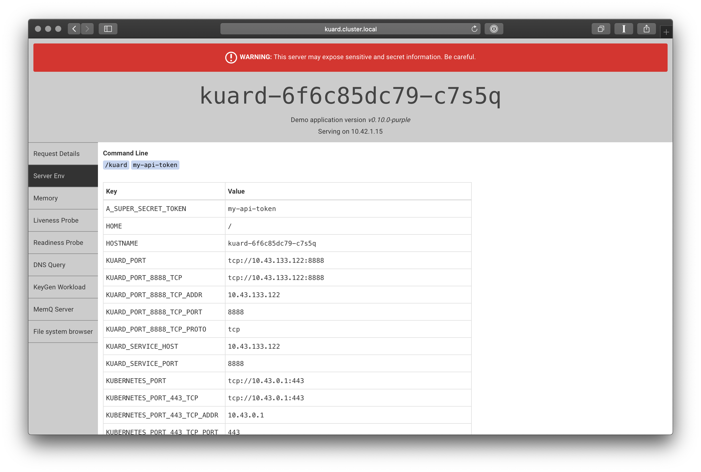

### Using Secrets

Now that we have used *ConfigMaps* we will try the same with *Secrets*.

Create the file `7-secret.yaml` with the following content.

```yaml
apiVersion: v1
kind: Secret
metadata:
  name: kuard
  labels:
    app: kuard
type: Opaque
data:
  secret-password: d2VsY29tZXdlbGNvbWUxIQ==
```

Apply the file as usual

```bash
❯ kubectl apply -f 7-secret.yaml
secret/kuard created
```

You will see that the resource is created

```bash
NAME                         TYPE                                  DATA   AGE
secret/kuard                 Opaque                                1      39s
```

You will notice that there is a "TYPE" field, normally you won't need to worry about this, it is used for programmatic handling of the secret data and is normally only explicitly set when using the command line (explained below). The `Opaque` *Secret* is the generic type for handling unstructured key/value pairs, there are a few other types you will encounter

- `kubernetes.io/service-account-token` - Created by Kubernetes to hold the token for *ServiceAccounts*
- `kubernetes.io/tls` - Used to store certificates and their keys
- `kubernetes.io/dockerconfigjson` - Used to store Docker credentials for authenticating with registries (you may see this as `kubernetes.io/dockercfg` also).

#### TLS Secret

So that you can see how they work we will create a TLS secret.

First, we need to actually generate the certificate. Use `openssl` to generate a certificate/key pair, following the prompts, enter any values you wish except for the "Common Name" where you should enter `kuard.cluster.local`.

```bash
openssl req -newkey rsa:2048 -new -nodes -x509 -days 365 -keyout tls.key -out tls.crt
Generating a 2048 bit RSA private key
...............................................................................................................................................+++
............................+++
writing new private key to 'key.pem'
-----
...
```

Once finished you should have 2 files, `tls.key` which is the private key, and `tls.cert` which is the actual certificate.

Now, to actually create a Kubernetes *Secret* you use the following command

```bash
❯ kubectl create secret tls kuard-tls --cert=tls.crt --key=tls.key
secret/kuard-tls created
```

You will then once again see a new resource

```bash
NAME                         TYPE                                  DATA   AGE
secret/kuard-tls             kubernetes.io/tls                     2      24s
```

If you get the *Secret* you will see it is essentially a *Secret* with 2 key/value pairs with the content of the files base64 encoded (you will also see additional fields, such as `uid`).

```bash
❯ kubectl get secret kuard-tls -o yaml
apiVersion: v1
kind: Secret
metadata:
  name: kuard-tls
  namespace: default
type: kubernetes.io/tls
data:
  tls.crt: <DATA REDACTED FOR SPACE>
  tls.key: <DATA REDACTED FOR SPACE>
```

The reason for the different `type` is so that applications such as [cert-manager](https://cert-manager.io) and the *Ingress Controller* know that the *Secret* contains a certificate they can use. (Shortly we will update the *Ingress* to use the certificate for HTTPS access).

#### Docker Credentials

The other type of *Secret* you may interact with is for storing Docker configuration, this is so that images can be pulled from private registries; you would supply the *Secret* name as the field `imagePullSecrets` on your *Pod* spec.

```bash
❯ kubectl explain pod.spec.imagePullSecrets
KIND:     Pod
VERSION:  v1

RESOURCE: imagePullSecrets <[]Object>

DESCRIPTION:
     ImagePullSecrets is an optional list of references to secrets in the same
     namespace to use for pulling any of the images used by this PodSpec. If
     specified, these secrets will be passed to individual puller
     implementations for them to use. For example, in the case of docker, only
     DockerConfig type secrets are honored. More info:
     https://kubernetes.io/docs/concepts/containers/images#specifying-imagepullsecrets-on-a-pod

     LocalObjectReference contains enough information to let you locate the
     referenced object inside the same namespace.

FIELDS:
   name <string>
     Name of the referent. More info:
     https://kubernetes.io/docs/concepts/overview/working-with-objects/names/#names
```

To create a Docker *Secret* simply run the following command.

```bash
❯ kubectl create secret docker-registry my-private-registry --docker-server=registry.example.com --docker-username=kubernetes --docker-password=password --docker-email=kubernetes@example.com
secret/my-private-registry created
```

If you retrieve the *Secret* you will see it contains a Docker configuration file (again, base64 encoded).

```bash
❯ kubectl get secret my-private-registry -o yaml
apiVersion: v1
kind: Secret
metadata:
  name: my-private-registry
  namespace: default
type: kubernetes.io/dockerconfigjson
data:
  .dockerconfigjson: eyJhdXRocyI6eyJyZWdpc3RyeS5leGFtcGxlLmNvbSI6eyJ1c2VybmFtZSI6Imt1YmVybmV0ZXMiLCJwYXNzd29yZCI6InBhc3N3b3JkIiwiZW1haWwiOiJrdWJlcm5ldGVzQGV4YW1wbGUuY29tIiwiYXV0aCI6ImEzVmlaWEp1WlhSbGN6cHdZWE56ZDI5eVpBPT0ifX19
```

#### Opaque Secrets

The majority of the time you will be creating opaque *Secrets*. You are probably thinking something along the lines of "What? Do I need to go to the effort of base64 encoding my values all the damn time?", luckily the answer is no.

There are 2 ways to go about this, the first is with a YAML file (remember though, you probably don't want to commit your *Secrets* to a repository) and the second is with the command line.

First, let's see how to do it with YAML files. Kubernetes allows you to supply the values unencoded, in a field named `stringData`.

```yaml
apiVersion: v1
kind: Secret
metadata:
  name: my-secret
type: Opaque
stringData:
  secret-password: my$uper$ecretP@ssw0rd
```

When applying this file it will work in exactly the same way as the file with encoded data, however when you retrieve the resource from the cluster you will always receive the encoded version. If you supply both `data` and  `stringData` only the latter is used.

The second way is using `kubectl` in much the same way it can be used to create the Docker credentials

```bash
❯ kubectl create secret generic my-app-secret --from-literal=foo=bar
```

This will create a *Secret* with 1 piece of data, the key `foo` with the value `bar`. You can supply `--from-literal` as many times as you need.

#### Secrets from Files

The security minded amongst you may have noticed a problem with the previous command (and the one for creating Docker credentials), running these commands will mean that your *Secret* values are now in your shell history.

Thankfully `kubectl` provides a way to load the data from files instead, like the following.

```bash
❯ kubectl create secret generic my-private-registry --from-file=.dockerconfigjson=~/.docker/config.json --type=kubernetes.io/dockerconfigjson`
```

Again the `--from-file` parameter can be provided as many times as needed; in the case of opaque *Secrets*, you simply don't set the `--type` parameter.

### Back to Using Secrets

Now we have discussed the different type of *Secrets* available, let's get back to actually making use of them...

As *Secrets* work in exactly the same way as *ConfigMaps* we won't go through all the examples, but let's update the *Deployment* to inject our *Secret* as an environment variable, we'll also load the *ConfigMap* as a directory for completeness sake.

```yaml
apiVersion: apps/v1
kind: Deployment
metadata:
  name: kuard
  labels:
    app: kuard
spec:
  selector:
    matchLabels:
      app: kuard
  template:
    metadata:
      labels:
        app: kuard
    spec:
      volumes:
        - name: config-volume
          configMap:
            name: kuard
      containers:
        - name: kuard
          image: gcr.io/kuar-demo/kuard-amd64:purple
          ports:
            - name: http
              containerPort: 8080
          volumeMounts:
            - name: config-volume
              mountPath: /config
          env:
            - name: A_SECRET_PASSWORD
              valueFrom:
                secretKeyRef:
                  name: kuard
                  key: secret-password
```

Apply the manifest and then visit the "Server Env" page again, you should see the *Secret* has been decoded from base64 and injected into the container.

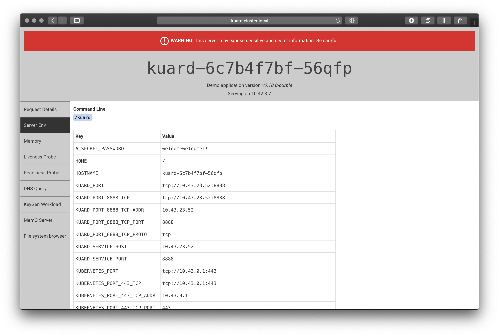

You can probably guess by now how the cluster looks, but the state is the following. (This is not strictly accurate, the `kuard-tls` *Secret* also exists because we never deleted it, but it is not being used either, we will use it in the next step).

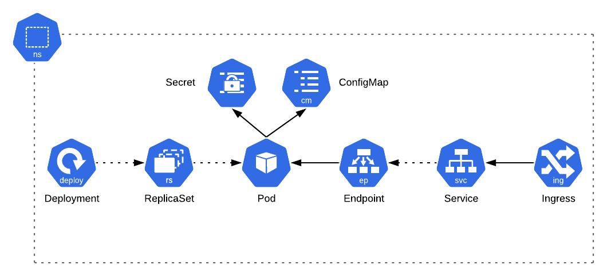

Now, change your browser so that you are using the address `https://kuard.cluster.local` instead. You should see a warning that the certificate is not valid, this is because the default certificate is for `*.example.com` (obviously in a production cluster you wouldn't have an invalid certificate as a fallback).

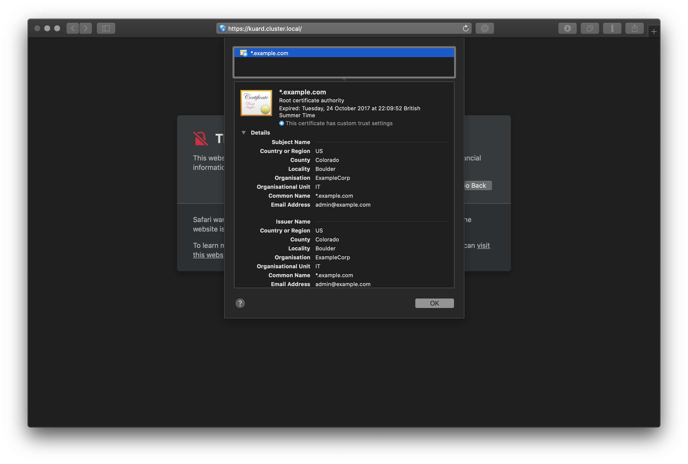

Let's update the *Ingress* to use the certificate we previously created. To do this we add `spec.tls` to the *Ingress*, this tells the *Ingress Controller* where it can find the certificate and which host it applies to (as you can have multiple hosts in the same *Ingress*).

```yaml
apiVersion: networking.k8s.io/v1beta1
kind: Ingress
metadata:
  name: kuard
  labels:
    app: kuard
spec:
  rules:
    - host: kuard.cluster.local
      http:
        paths:
          - path: /
            backend:
              serviceName: kuard
              servicePort: 8888
  tls:
    - hosts:
        - kuard.cluster.local
      secretName: kuard-tls
```

Apply the file and visit `https://kuard.cluster.local`. You will almost certainly get an error again, but if you view it you will see that the certificate belongs to "kuard.cluster.local"; the reason for the error is because we generated a self-signed certificate, when using certificates for real you will get a certificate from a trusted certificate authority.

After applying the *Ingress* changes the cluster now looks like this

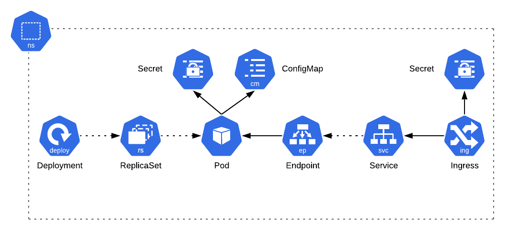

This may sound like a lot of work, thankfully there are ways to automate this process, with the use of [cert-manager](https://cert-manager.io) certificates can automatically be requested from [Let's Encrypt](https://letsencrypt.org) simply by creating an *Ingress* with an *Annotation*.

We haven't talked about *Annotations* yet. Much like *Labels*, they are for applying metadata to a resource, however they are meant for programmatic usage, where as *Labels* are for humans.

```bash
❯ kubectl explain ingress.metadata.annotations
KIND:     Ingress
VERSION:  extensions/v1beta1

FIELD:    annotations <map[string]string>

DESCRIPTION:
     Annotations is an unstructured key value map stored with a resource that
     may be set by external tools to store and retrieve arbitrary metadata. They
     are not queryable and should be preserved when modifying objects. More
     info: http://kubernetes.io/docs/user-guide/annotations
```

Applications use *Annotations* for configuration, if we had cert-manager installed it would just be a case of adding *Annotations* to the `metadata` of the *Ingress*, something like the following

```yaml
annotations:
  cert-manager.io/cluster-issuer: letsencrypt-prod
```

cert-manager watches for certain *Annotations*, essentially using the same *Control Loop* mechanism we discussed in the introduction, and then requests certificates based on their value (this one tells it the name of the *ClusterIssuer* *CustomResourceDefinition* to use for requesting certificates); if you are interested you can [read more about it in the documentation](https://cert-manager.io/docs/usage/ingress/#supported-annotations), but it is not required.

Since we have HTTPS support we can stop visitors from accessing the application via HTTP (or redirect them), this is again where *Annotations* come in. You probably shouldn't do this right now (since we have a self signed certificate) but to do so we would add the following annotations the *Ingress* resource.

```yaml
annotations:
  traefik.ingress.kubernetes.io/frontend-entry-points: http,https
  traefik.ingress.kubernetes.io/redirect-entry-point: https
  traefik.ingress.kubernetes.io/redirect-permanent: "true"
```

These *Annotations* are Traefik specific values (hence the prefix `traefik.ingress.kubernetes.io`), telling the *Ingress Controller* to accept traffic on the HTTP and HTTPS backends & to redirect all traffic to the HTTPS port using a HTTP 301 redirect. More about the *Annotations* can be found in the [Traefik documentation](https://docs.traefik.io/v1.7/configuration/backends/kubernetes/#annotations) but again it is not essential to read now. If you wanted the traffic on every *Ingress* to always redirect to HTTPS you could instead do so by editing the Traefik configuration, which is stored in a *ConfigMap* in the "kube-system" *Namespace*, but doing so is outside of the scope of this tutorial (just remember to restart Traefik's *Pods*).

```bash
❯ kubectl -n kube-system get configmap traefik -o yaml
apiVersion: v1
data:
  traefik.toml: |
    # traefik.toml
    logLevel = "info"
    defaultEntryPoints = ["http","https"]
    ...
```

Note: It has not been mentioned before, but the `-n` parameter is how you run commands in different *Namespaces*, it is also possible to supply the *Namespace* on resource definitions alongside the name; you can also change `kubectl` so that the *Namespace* it uses if none is supplied is not "default".

```bash
❯ kubectl config set-context --current --namespace=my-awesome-namespace
Context "dev" modified.
```

## Persisting Data

So far we have created applications which are entirely stateless, but there will be times you want to persist data and do not need to use a *StatefulSet*, for example user uploads or generated files. For this you can use a *PersistentVolume*.

Normally you would not create the *PersistentVolume* directly, instead you would create a *PersistentVolumeClaim*. When the *PersistentVolumeClaim* is used it will cause the *PersistentVolume* to be created, using the specified *StorageClass* to dynamically provision the actual storage. *StorageClasses* and *PersistentVolumes* are cluster wide resources, where as *PersistentVolumeClaims* are scoped to a *Namespace*.

Just as with *Ingress Controllers* and *NetworkPolicies* you are expected to provide an implementation to back a *StorageClass*, luckily k3d comes with [Rancher's Local Path Provisioner](https://github.com/rancher/local-path-provisioner) included.

```bash
❯ kubectl get storageclasses
NAME                   PROVISIONER             AGE
local-path (default)   rancher.io/local-path   24h
```

You may have already realised, but the `(default)` implies that you can have more than one *StorageClass* configured, so it is recommended that you define the required *StorageClass* on any *PersistentVolumeClaim*.

Let's start by creating the claim, create a file called `8-pvc.yaml`

```yaml
apiVersion: v1
kind: PersistentVolumeClaim
metadata:
  name: kuard
  labels:
    app: kuard
spec:
  storageClassName: local-path 
  accessModes:
    - ReadWriteOnce
  resources:
    requests:
      storage: 100Mi
```

Now apply the file and then `get` the new resource

```bash
❯ kubectl apply -f 8-pvc.yaml
persistentvolumeclaim/kuard created
```

In the other terminal you will see the *PersistentVolumeClaim* has been created.

```bash
NAME    STATUS    VOLUME   CAPACITY   ACCESS MODES   STORAGECLASS   AGE
kuard   Pending                                      local-path     8s
```

You will notice that the "STATUS" of the claim is Pending, and it will stay like this until we use it, you can try `kubectl get persistentvolumes` and you will see that the *PersistentVolume* has not been created yet.

Now it is time to consume the *PersistentVolumeClaim*, see if you can figure this out yourself, update your *Deployment*, remembering you need to add the *Volume*, and then mount it into the container, you can use this command `kubectl explain deployment.spec.template.spec.volumes` for help. The expected manifest will look something like the following.

```yaml
apiVersion: apps/v1
kind: Deployment
metadata:
  name: kuard
  labels:
    app: kuard
spec:
  selector:
    matchLabels:
      app: kuard
  template:
    metadata:
      labels:
        app: kuard
    spec:
      volumes:
        - name: config-volume
          configMap:
            name: kuard
        - name: data-volume
          persistentVolumeClaim:
            claimName: kuard
      containers:
        - name: kuard
          image: gcr.io/kuar-demo/kuard-amd64:purple
          ports:
            - name: http
              containerPort: 8080
          volumeMounts:
            - name: config-volume
              mountPath: /config
            - name: data-volume
              mountPath: /data
          env:
            - name: A_SECRET_PASSWORD
              valueFrom:
                secretKeyRef:
                  name: kuard
                  key: secret-password
```

Apply the manifest and you should see the *PersistentVolumeClaim* change, and you will also see the new *PersistentVolume* resource.

```bash
NAME    STATUS   VOLUME                                     CAPACITY   ACCESS MODES   STORAGECLASS   AGE
kuard   Bound    pvc-14f9b407-3dff-498b-beaf-d72f9f0018e0   100Mi      RWO            local-path     11m

NAME                                       CAPACITY   ACCESS MODES   RECLAIM POLICY   STATUS   CLAIM           STORAGECLASS   REASON   AGE
pvc-14f9b407-3dff-498b-beaf-d72f9f0018e0   100Mi      RWO            Delete           Bound    default/kuard   local-path              17s
```

So now that a *PersistentVolume* has been created, the cluster looks like this.

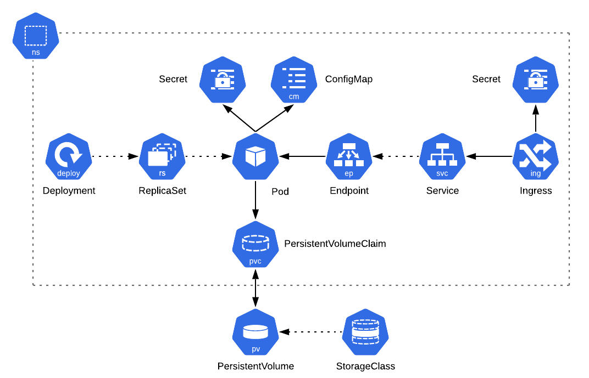

If you browse to `http://kuard.cluster.local` again then select the "File system browser" you will see the new directory, but right now it is empty so let's create a file.

The `local-path` provisioner creates a directory on the filesystem of the *Node*, use the following command to find out which *Node* the *PersistentVolume* is on

```bash
❯ kubectl get persistentvolumes -o jsonpath='{.items[0].spec.nodeAffinity.required.nodeSelectorTerms[0].matchExpressions[0].values[0]}'
k3d-dev-worker-2
```

You will notice this matches the "NODE" of the *Pods*, in fact if you were paying attention, when the *PersistentVolume* was created you would have noticed a *Pod* being evicted and recreated on the same *Node* as the other *Pod*. The reason for this is that all the *Pods* need to be able to access the local path, so as you can imagine, you should not use the `local-path` *StorageClass* in a real cluster, cloud providers normally include an *StorageClass* for creating native storage resources (provisioned by the *Cloud-Controller Manager*) and there are other options available such as the [NFS Client Provisioner](https://github.com/kubernetes-incubator/external-storage/tree/master/nfs-client).

Use the following command to get the path of the directory on the *Node*.

```bash
❯ kubectl get persistentvolumes -o jsonpath='{.items[0].spec.hostPath.path}'
/var/lib/rancher/k3s/storage/pvc-14f9b407-3dff-498b-beaf-d72f9f0018e0
```

We can these use these 2 values to create a file directly on the *Node*.

```bash
NODE=$(kubectl get persistentvolumes -o jsonpath='{.items[0].spec.nodeAffinity.required.nodeSelectorTerms[0].matchExpressions[0].values[0]}')
PATH=$(kubectl get persistentvolumes -o jsonpath='{.items[0].spec.hostPath.path}'

docker exec $NODE sh -c "echo 'Hello from the Node' > $PATH/hello.txt"
```

Now if you go back to the application in the browser you should see the file in the mounted directory, but how do you know this is persistent?

Let's create a file directly on the *Pod*.

```bash
❯ kubectl scale deployment/kuard --replicas=1
❯ kubectl exec deployment/kuard -- sh -c "echo 'Hello from the Pod' > /tmp/hello2.txt"
```

> The reason for scaling down the *Deployment* is so that we know that the *Pod* the file is created on is the same
> one we will be directed to when using the application.

Use the file browser to check the file. Now kill the *Pod* and once the new one has started browse to the two files to prove that the first file persists and the second does not.

```bash
❯ kubectl delete pods -l app=kuard
pod "kuard-66b687b4bd-r4hsk" deleted
```

## Maintaining Application and Cluster Health

In order to keep the application running smoothly, there are a few more steps which should be taken

- Create replicas
- Set a Deployment strategy
- Add resource limits
- Add readiness and liveness probes for health checks

### Reacting to losing a Node

Before that though, let's prove that Kubernetes is self healing and is able to recover from a *Node* disappearing.

Create the file `9-deployment-with-tolerations.yaml` with the following content.

```yaml
apiVersion: apps/v1
kind: Deployment
metadata:
  name: kuard
  labels:
    app: kuard
spec:
  selector:
    matchLabels:
      app: kuard
  template:
    metadata:
      labels:
        app: kuard
    spec:
      tolerations:
        - key: "node.kubernetes.io/unreachable"
          operator: "Exists"
          effect: "NoExecute"
          tolerationSeconds: 5
        - key: "node.kubernetes.io/not-ready"
          operator: "Exists"
          effect: "NoExecute"
          tolerationSeconds: 5
      volumes:
        - name: config-volume
          configMap:
            name: kuard
      containers:
        - name: kuard
          image: gcr.io/kuar-demo/kuard-amd64:purple
          ports:
            - name: http
              containerPort: 8080
          volumeMounts:
            - name: config-volume
              mountPath: /config
          env:
            - name: A_SECRET_PASSWORD
              valueFrom:
                secretKeyRef:
                  name: kuard
                  key: secret-password
```

You may notice that we have removed the *PersistentVolumeClaim* volume and volume mount; we are only doing this because the `local path` provisioner is being used so all *Pods* for the *Deployment* are on the same *Node*, on a real cluster you want to avoid this situation.

We also have `tolerations` defined, we previously mentioned these at the start of the tutorial, they are how *Kubelet* and the *Scheduler* know whether *Pods* are allowed on *Nodes* which have been *tainted*. Kubernetes has a featured known as [Taint Based Evictions](https://kubernetes.io/docs/concepts/configuration/taint-and-toleration/#taint-based-evictions), this means that when a *Node* meets certain conditions (mentioned on the linked page) it is tainted to say that is it unhealthy. For example, if the *Node* becomes unreachable the taint `node.kubernetes.io/unreachable` is added to it, by default Kubernetes will *tolerate* these *taints* for 300 seconds, however for testing purposes we have set it to 5 seconds. In a production real cluster you almost certainly don't want to change this so you can leave the `tolerations` out of the manifest. 

*Taints* have 3 effects, `NoSchedule` which means the *Pod* should never be scheduled on the *Node*, however if the *taint* is added after it is already scheduled the *Pod* will not be evicted, `PreferNoSchedule` which means the *Pod* can be scheduled but only as a last resort and `NoExecute` which means the *Pod* should be evicted from the *Node* if it is already scheduled. 

So in the *Deployment* we have said that we can *tolerate* the *taints* `node.kubernetes.io/unreachable` and `node.kubernetes.io/not-ready` with an effect of `NoExecute` for 5 seconds, after which time the *Pod* will be evicted from the tainted *Node* and the *ReplicaSet* will result in it being rescheduled on a healthy *Node*.

So now that we have explained *taints* and *tolerations*, apply the manifest with `kubectl`. You may also want to cancel the `watch` command on the second terminal and rerun it with just the following as these are the only resources we care about from this point onwards.

```bash
❯ kubectl apply -f 9-deployment-with-tolerations.yaml
deployment.apps/kuard configured

❯ watch kubectl get nodes,pod,deploy,rs -o wide
```

Scale to 3 replicas also

```bash
❯ kubectl scale deployment/kuard --replicas=3
```

Now, if you look at the other terminal you should see that the 3 *Pods* should each be scheduled on a different *Node*. You can also see that the *ReplicaSet* had "DESIRED", "CURRENT" and "READY" all set to 3.

We are going to shutdown the *Node* "k3d-dev-worker-1" to simulate it becoming unreachable.

```bash
❯ docker stop k3d-dev-worker-1
```

After approximately 30 seconds the "STATUS" of the *Node* should change to "NotReady", then approximately 5 seconds later the *Pod* will change to "Terminating" and a new one created. This shows that the cluster has automatically recovered from a missing *Node*. The status will stay at "Terminating" because the *API Server* has not yet been told that the *Pod* has been terminated, once the *Node* recovers *Kubelet* will see that the *Pod* is supposed to be terminated so will do so.

Start the *Node* again and you will see this happen.

```bash
❯ docker start k3d-dev-worker-1
```

At this point you have 2 *Pods* from the same *ReplicaSet* on the same *Node*, in a production environment this is less likely to happen, it is just that we have the exactly same number of replicas as we do Nodes; however you can "fix" this simply by deleting one of the *Pods*. Just like there is the *Scheduler* component, there is also a [Descheduler](https://github.com/kubernetes-sigs/descheduler) to take care of this automatically but it is not a core component, this actually runs as a *Job*.

You can now re-add the *PersistentVolumeClaim* volume and volume mount to the *Deployment*, and remove the *tolerations*.

### Replicas

When running an application on a production cluster you want to run at least 3 replicas for a *Deployment*, this ensures that if a *Node* goes down you still have a fallback until a new *Pod* is scheduled.

Previously we set the number of replicas using `kubectl`, however this is not the best way to do it, as in reality you would want it defined in your manifest (which you are of course storing in a version control system, right?). 

Thankfully it is just a case of setting one field.

```bash
❯ kubectl explain deployment.spec.replicas
KIND:     Deployment
VERSION:  apps/v1

FIELD:    replicas <integer>

DESCRIPTION:
     Number of desired pods. This is a pointer to distinguish between explicit
     zero and not specified. Defaults to 1.
```

Reset the number of replicas back to 1 with `kubectl`

```bash
❯ kubectl scale deployment/kuard --replicas=1
```

Set the field on your *Deployment* and then apply it as usual, you will see the *Pods* created in exactly the same way as if you had scaled using `kubectl scale`.

If you want to turn off your application without deleting the resources you can set the replicas to 0, however it is worth nothing that if you have an *Ingress* defined then any visitors will receive a "HTTP 503 Service Unavailable" response instead of the normal "HTTP 404 Not Found" response.

### Blue-Green Deployments

In a production system, when you are deploying updates, you typically don't want your application to stop working whilst you are updating, this is known as a [Blue-Green Deployment](https://martinfowler.com/bliki/BlueGreenDeployment.html) because you basically switch your "router" between 2 servers called blue and green, this is essentially how rolling updates work in Kubernetes.

By default *Deployments* already use rolling updates, if, for some reason you instead need all the *Pods* destroyed before new *Pods* are created you can set `spec.strategy` to `Recreate`.

```bash
❯ kubectl explain deployment.spec.strategy
KIND:     Deployment
VERSION:  apps/v1

RESOURCE: strategy <Object>

DESCRIPTION:
     The deployment strategy to use to replace existing pods with new ones.

     DeploymentStrategy describes how to replace existing pods with new ones.

FIELDS:
   rollingUpdate	<Object>
     Rolling update config params. Present only if DeploymentStrategyType =
     RollingUpdate.

   type	<string>
     Type of deployment. Can be "Recreate" or "RollingUpdate". Default is
     RollingUpdate.
``` 

There are a couple of options which can be tweaked when using rolling update, the first `maxUnavailable` dictates the maximum amount of *Pods* belonging to the *ReplicaSet* which can be unavailable during an update, and `maxSurge` dictates the amount of *Pods* above the `replica` count which can be created during an update.

Both of these fields can either be an absolute value (i.e. `1`) or a percentage (`25%`), the default value is `25%`. You can not set both fields to 0 at the same time, otherwise it would not be possible to destroy nor create *Pods*.

So take the following example

```yaml
spec:
  replicas: 3
  strategy:
    type: RollingUpdate
    rollingUpdate:
      maxSurge: 1
      maxUnavailable: 1
```

This means that Kubernetes will let the number of *Pods* running drop to 2 and increase to 4 during a rolling update, i.e. when the *Scheduler* places a *Pod* the *ReplicaSet* will not create another one if 4 are already running, once the excess are terminated it will then create the next one, similarly when terminating the old *Pods* it will stop when there are only 2 running until another has fully started.

Try playing with these values and setting `spec.strategy` to "Recreate" to see how they work.

To see the rolling update in action, change the image tag of the container to one of `purple`, `blue` or `green`, the image has these 3 tags available. If you apply the manifest you will see the new *ReplicaSet* is created, with a different image and the old *Pods* are destroyed whilst the new ones are created. If you try applying the manifest again you will see that nothing happens, this is because the cluster is already in the desired state dictated by the manifest.

### Resource Management

In order to ensure the cluster remains responsive and stable you need to manage the resources that your applications can use, first you can apply a *ResourceQuota* on a per *Namespace* basis to set aggregate limits for all *Pods*, and more importantly you can set *ResourceRequirements* on a per container level.

*ResourceRequirements* are set by providing the `resources` value on each container. There are 2 types of *ResourceRequirements*; `limits`, which sets the maximum resources the container may use, and `requests` which is essentially the minimum resources the container requires, the *Scheduler* will use these values when scheduling your *Pods*; if you do not provide `requests` it will default to the `limits`, and if you don't provide a `limits` there is no resource restrictions, which is naturally a bad idea. As should be obvious, `limits` can not be lower than `requests`.

There are several types of resources available.

- `cpu` - The amount of CPU usage the container is allowed, measured in cores or millicores, 1 being one core, and `100m` being 100 millicores, 1 core is equal to 1000 millicores. If the container breaches the limit it will be throttled.
- `memory` - The amount of memory the container is allowed, in bytes using the standard suffixes of E, P, T, G, M or K or in [binary/SI units](https://en.wikipedia.org/wiki/Binary_prefix) using suffixes of Ei, Pi, Ti, Gi, Mi or Ki where `1000Ki` is `1Mi` and `1M` is approximately `0.954Mi` If a container breaches the limit the *Pod* will be killed with an `OOMKilled` (Out of Memory Killed) status. 
- `ephemeral-storage` - Essentially the amount of temporary storage which can be consumed on the *Node*, used for things such as logs, the `emptyDir` volume type and writable image layers. As with memory, in bytes, either in the standard units or binary. If a container breaches the limit the *Pod* will be evicted from the *Node*.

There is also a `hugepage-*` resource type but this is quite a [specialised resource type](https://kubernetes.io/docs/tasks/manage-hugepages/scheduling-hugepages/).

Kubernetes has the ability to use extended resources for limiting the use of other resources, for example specialised hardware resources, you can read about this in the [documentation](https://kubernetes.io/docs/concepts/configuration/manage-compute-resources-container/#extended-resources)

Typically you only really need to supply the first 2 of these, `cpu` and `memory`. As an example your *ResourceRequirements* may look like the following

```yaml
spec:
  containers:
    - name: kuard
      image: gcr.io/kuar-demo/kuard-amd64:purple
      resources:
        requests:
          cpu: 100m
          memory: 128Mi
        limits:
          cpu: 500m
          memory: 256Mi
```

This means that during *Scheduling* the containers needs at least one tenth of a core (100 millicores) and 128Mi of available memory and it is limited to only using half a core (500 millicores) and 256Mi of memory.

Now let's try to see what happens when these limits are breached, obviously this is a bit hard to force.

> WARNING: Do not try these experiments if you are running this tutorial on a real Kubernetes cluster running on a cloud provider, you could accidentally cause more *Nodes* to be created which will cost you money especially if they are powerful machines.

Use the `describe` command to check the allocated resources on each of your *Nodes*.

```bash
❯ kubectl describe node/k3d-dev-worker-0
Name:               k3d-dev-worker-0
Roles:              worker
...
Capacity:
  cpu:                4
  ephemeral-storage:  61255492Ki
  hugepages-1Gi:      0
  hugepages-2Mi:      0
  memory:             2037260Ki
  pods:               110
Allocatable:
  cpu:                4
  ephemeral-storage:  59589342571
  hugepages-1Gi:      0
  hugepages-2Mi:      0
  memory:             2037260Ki
  pods:               110
...
Allocated resources:
  (Total limits may be over 100 percent, i.e., overcommitted.)
  Resource           Requests   Limits
  --------           --------   ------
  cpu                100m (2%)  0 (0%)
  memory             70Mi (3%)  170Mi (8%)
  ephemeral-storage  0 (0%)     0 (0%)
```

Shut down 2 of the *Nodes*

```bash
❯ docker stop k3d-dev-worker-1 k3d-dev-worker-2
```

Create a file `10-pod-with-high-memory.yaml` containing a *Pod* with a container which has a `resources.requests.memory` more than your capacity, for example 1Ti, so that it looks something like the following

```yaml
apiVersion: v1
kind: Pod
metadata:
  name: limit-test
spec:
  containers:
    - name: kuard
      image: gcr.io/kuar-demo/kuard-amd64:purple
      resources:
        requests:
          memory: 1Ti
```

Apply the file and you will notice the new *Pod* has a "STATUS" of Pending which never changes. 

You can use the `describe` command to find out why

```bash
❯ kubectl describe pod/limit-test
Name:         limit-test
...
Events:
  Type     Reason            Age        From               Message
  ----     ------            ----       ----               -------
  Warning  FailedScheduling  <unknown>  default-scheduler  0/4 nodes are available: 4 Insufficient memory.
```

Exactly as you would expect! Delete the *Pod*, then edit the `memory` to a sensible value, apply the file and now you will see the is *Pod* created. If you `describe` the *Pod* you will instead see this time that it was Scheduled, Pulled, Created and Started.

> Note: The reason for deleting the *Pod* is because most fields are immutable on *Pods*, this is not a problem when editing a *Deployment* as you would be editing the template which the *ReplicaSet* uses for the *Pod* rather than the *Pod* itself.

Now do the same thing with `resources.requests.cpu`, for example set it to 10 or 10000m to request 10 cores (surely you don't have that many!). 

Apply the file and once again run `describe`, the output again says why the *Pod* is stuck Pending.

```bash
❯ kubectl describe pod/limit-test
Name:         limit-test
...
Events:
  Type     Reason            Age        From               Message
  ----     ------            ----       ----               -------
  Warning  FailedScheduling  <unknown>  default-scheduler  0/4 nodes are available: 4 Insufficient cpu.
```

FIXME: Add a test for ephemeral-storage

We are now going to make the *Pod* run a stress test to use up the available memory.

Delete the *Pod* and then create a new manifest called `11-pod-with-low-memory.yaml` which looks something like the following, set the `resources.requests` to sensible values and set the `resources.limits` higher but not too high.

```yaml
apiVersion: v1
kind: Pod
metadata:
  name: limit-test
spec:
  containers:
    - name: stress
      image: polinux/stress
      resources:
        requests:
          memory: 50Mi
          cpu: 100m
        limits:
          memory: 100Mi
          cpu: 110m
      command: ["stress"]
      args: ["--vm", "10", "--vm-bytes", "250M", "--vm-hang", "1", "--vm-keep"]
```

Apply the manifest, the *Pod* will start and it will start using up more memory. You should soon see the *Pod* status change to "OOMKilled", the container will restart a few times and eventually the *Pod* ends up with a status of "CrashLoopBack" (this is because our *Pod* is crashing quickly and often, normally it would just restart). Describe the *Pod* and you will see it is being killed because it is out of memory.

```bash
❯ kubectl describe pod/limit-test
Name:         limit-test
...
Containers:
  stress:
    ...
    State:          Terminated
      Reason:       OOMKilled
      Exit Code:    3
      Started:      Wed, 22 Jan 2020 21:48:43 +0000
      Finished:     Wed, 22 Jan 2020 21:48:48 +0000
```

CPU throttling is harder to demonstrate, I was not able to get a demo working properly on a virtual cluster but you can find an example on the [Kubernetes site](https://kubernetes.io/docs/tasks/configure-pod-container/assign-cpu-resource/).

Now we've finished, delete the *Pod* and start the *Nodes* again.

```bash
❯ kubectl delete pod/limit-test
pod "limit-test" deleted
❯ docker start k3d-dev-worker-1 k3d-dev-worker-2
```

Create the file `13-deployment-with-resources.yaml` with sensible *ResourceRequirements*, then apply it. 

```yaml
apiVersion: apps/v1
kind: Deployment
metadata:
  name: kuard
  labels:
    app: kuard
spec:
  replicas: 3
  strategy:
    type: RollingUpdate
    rollingUpdate:
      maxSurge: 1
      maxUnavailable: 1
  selector:
    matchLabels:
      app: kuard
  template:
    metadata:
      labels:
        app: kuard
    spec:
      volumes:
        - name: config-volume
          configMap:
            name: kuard
        - name: data-volume
          persistentVolumeClaim:
            claimName: kuard
      containers:
        - name: kuard
          image: gcr.io/kuar-demo/kuard-amd64:purple
          ports:
            - name: http
              containerPort: 8080
          volumeMounts:
            - name: config-volume
              mountPath: /config
            - name: data-volume
              mountPath: /data
          env:
            - name: A_SECRET_PASSWORD
              valueFrom:
                secretKeyRef:
                  name: kuard
                  key: secret-password
          resources:
            requests:
              cpu: 100m
              memory: 128Mi
            limits:
              cpu: 500m
              memory: 256Mi
```

### Health Checks

The final step to make sure your application is resilient is to add health checks to your *Deployment*. Kubernetes has 3 types of health checks, known as *probes* which are supplied on a per container basis. These *probes* are performed by *Kubelet*. If any particular *probe* is not provided they are always considered successful.

- `LivenessProbe` - Checks that the application is live, if it fails the container is killed and restarted depending upon the *Pods* `spec.restartPolicy`.
- `ReadinessProbe` - For checking that the application is able to receive traffic, if not it is removed from the *Endpoints* created by any *Service* pointing to the *Pod* and re-added when the probe is successful.
- `StartupProbe` - Normally not used as the `LivenessProbe` generally does the same thing, but if your application takes a long time to startup the `LivenessProbe` may not be suitable as you would need to increase the failure threshold to a value which would be unsuitable for checking liveness once the application is running. If the *probe* fails the container is restarted. The other 2 *probes* do not run until this probe has been successful.

Each of the *probes* can perform one of 3 different tests.

- `httpGet` - Perform a HTTP GET request to check the health of the container, considered successful if the response code is in the 2xx or 3xx range.
- `tcpSocket` - Opens a socket connection to a supplied port, considered successful if the port is open.
- `exec` - Executes a command in the container, considered successful if the command exits with the 0 exit code.

Each of these probes have different options, use the `kubectl explain` command to see the options.

```bash
❯ kubectl explain deployment.spec.template.spec.containers.livenessProbe.httpGet
KIND:     Deployment
VERSION:  apps/v1

RESOURCE: httpGet <Object>

DESCRIPTION:
     HTTPGet specifies the http request to perform.

     HTTPGetAction describes an action based on HTTP Get requests.

FIELDS:
   host	<string>
     Host name to connect to, defaults to the pod IP. You probably want to set
     "Host" in httpHeaders instead.

   httpHeaders	<[]Object>
     Custom headers to set in the request. HTTP allows repeated headers.

   path	<string>
     Path to access on the HTTP server.

   port	<string> -required-
     Name or number of the port to access on the container. Number must be in
     the range 1 to 65535. Name must be an IANA_SVC_NAME.

   scheme	<string>
     Scheme to use for connecting to the host. Defaults to HTTP.
```

Create the file `14-deployment-with-probes.yaml` with the following content.

```yaml
apiVersion: apps/v1
kind: Deployment
metadata:
  name: kuard
  labels:
    app: kuard
spec:
  replicas: 1
  strategy:
    type: RollingUpdate
    rollingUpdate:
      maxSurge: 1
      maxUnavailable: 1
  selector:
    matchLabels:
      app: kuard
  template:
    metadata:
      labels:
        app: kuard
    spec:
      volumes:
        - name: config-volume
          configMap:
            name: kuard
        - name: data-volume
          persistentVolumeClaim:
            claimName: kuard
      containers:
        - name: kuard
          image: gcr.io/kuar-demo/kuard-amd64:purple
          ports:
            - name: http
              containerPort: 8080
          volumeMounts:
            - name: config-volume
              mountPath: /config
            - name: data-volume
              mountPath: /data
          env:
            - name: A_SECRET_PASSWORD
              valueFrom:
                secretKeyRef:
                  name: kuard
                  key: secret-password
          resources:
            requests:
              cpu: 100m
              memory: 128Mi
            limits:
              cpu: 500m
              memory: 256Mi
          livenessProbe:
            httpGet:
              path: /healthy
              port: 8080
            initialDelaySeconds: 5
            periodSeconds: 10
            failureThreshold: 3
          readinessProbe:
            httpGet:
              path: /ready
              port: 8080
            initialDelaySeconds: 30
            periodSeconds: 10
            failureThreshold: 3
```

Here we add 2 *probes*, a *livenessProbe* which makes a request to `/healthy` and a *readinessProbe* which makes a request to `/ready`. 

There are a couple of options here also.

- `initialDelaySeconds` - sets how long after the container starts before the probe begins
- `failureThreshold` - sets how many failures there can be before the probe is actually considered a failure
- `periodSeconds` - sets how often to run the probe.

Each of these values have different defaults and there are a few more options, see the `kubectl explain` command for more information; the reason for including them here is to demonstrate when you would want to include a `startupProbe`.

If your container would normally take longer than the following parameters from the `livenessProbe` to start, you should define a `startupProbe` as well using the same test as the `livenessProbe`, then increase the `failureThreshold`.

> initialDelaySeconds + failureThreshold × periodSeconds

Note: The number of replicas have been reduced to 1 to make testing easier.

Apply the manifest file and then visit the application in your browser.

On the left hand side select the "Liveness Probe" menu option. You will see the application showing the probes as they happen, and at the top of the page, options like the following.


Select the "Fail" option to set the probe so that it always fails. Since we have the `livenessProbe.failureThreshold` set to 3 you will see the first 2 requests in the log with a status of 500, after this point the third probe will fail 10 seconds later. If you watch the *Pod* in your second terminal you will see it restarting and the restart count will increase. The *Pod* will have also been removed from the *Endpoints* but since it will restart quickly this may be hard to demonstrate, so instead we will prove this with the *readinessProbe*.

Now visit the "Readiness Probe" page. If you select the "Fail" option the *Pod* will start to fail, but it will never automatically restart because the `readinessProbe` just removed the *Pod* from the *Endpoints* for the *Service*; for this reason you should use something like [Prometheus](https://prometheus.io) (discussed in a later chapter) to alert you to *Pods* which are not ready.

Instead, select the "10" option. Wait until the 3rd probe and the *Endpoints* will be removed from the *Service* so it will no longer work as there is only 1 replica. You'll notice that the "READY" value of the *Pod* has changed to `0/1`.

Retrieve the *Endpoints* using `kubectl` and you will see that the *Pod* is now in `subsets.notReadyAddresses`. This means that the *Service* will no longer point to the not ready *Pod*.

```bash
❯ kubectl get endpoints/kuard -o yaml
apiVersion: v1
kind: Endpoints
metadata:
  name: kuard
  namespace: default
  labels:
    app: kuard
subsets:
- notReadyAddresses:
  - ip: 10.42.0.6
    nodeName: k3d-dev-worker-0
    targetRef:
      kind: Pod
      name: kuard-6fc5cb67d6-mnqb8
      namespace: default
  ports:
  - port: 8080
    protocol: TCP
```

If you try to reload the page you'll get "Service Unavailable". Wait for a while (since we have set it to fail for 10 probes it'll be another 70 seconds) and the "STATUS" will change back to `1/1`, if you examine the *Endpoints* you will see that it has been removed from `subsets.notReadyAddresses` and moved back to `subsets.addresses`, the page will then load again.

Obviously you wouldn't really be running with 1 *replica*, so increase to 3 *replicas* and try the various options again, you will see that the application keeps working even when the *probes* are failing on a particular *Pod*.

Note: When you use the probe pages you will see inconsistent results as you will be making requests to, and receiving responses from, different *Pods* each request. You may be wondering if there is a way to ensure all requests from a single user goes to the same *Pod*, for example if you have PHP sessions? Normally you would not want to do this as it would typically be better to handle this at the application level, for example using a database or [memcached](https://memcached.org) instance to store sessions; however you can use the *Service* `spec.sessionAffinity` field to do this but "sticky sessions" are a violation of [The Twelve Factor App](https://12factor.net/processes).

## Summary

By this point you should have an understanding of the following topics

- Using `kubectl api-resources` and `kubectl explain` for documentation
- Pods
- Labels, Annotations, Taints & Toleration
- Deployments and ReplicaSets
- Ports and Services
- Ingresses
- Creating ConfigMaps & Secrets
- Using ConfigMaps & Secrets as Volumes and Environment Variables
- TLS Secrets & Using them with Ingresses
- Using Persistent Volumes
- Replicas and Deployment Strategy
- Resource Management and Health Checks
